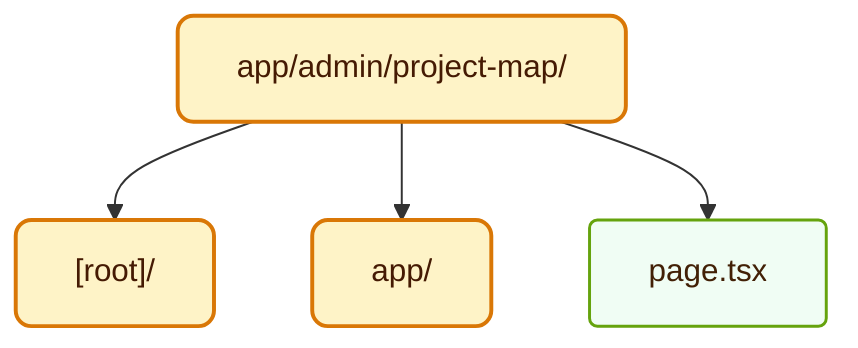

# Project Map — app/admin/project-map

```mermaid
flowchart TB
  classDef folder fill:#fef3c7,stroke:#d97706,stroke-width:2,color:#451a03,rx:8,ry:8
  classDef file fill:#f0fdf4,stroke:#65a30d,stroke-width:1.5,color:#422006,rx:4,ry:4
  app_admin_project_map["app/admin/project-map/" ]
  class app_admin_project_map folder
  app_admin_project_map__root_["[root]/"]
  class app_admin_project_map__root_ folder
  app_admin_project_map --> app_admin_project_map__root_
  app_admin_project_map_app["app/"]
  class app_admin_project_map_app folder
  app_admin_project_map --> app_admin_project_map_app
  app_admin_project_map_page_tsx["page.tsx"]
  class app_admin_project_map_page_tsx file
  app_admin_project_map --> app_admin_project_map_page_tsx
```
