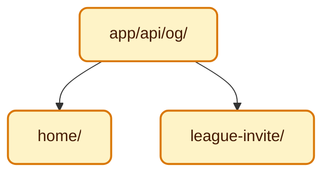

# Project Map — app/api/og

```mermaid
flowchart TB
  classDef folder fill:#fef3c7,stroke:#d97706,stroke-width:2,color:#451a03,rx:8,ry:8
  classDef file fill:#f0fdf4,stroke:#65a30d,stroke-width:1.5,color:#422006,rx:4,ry:4
  app_api_og["app/api/og/" ]
  class app_api_og folder
  app_api_og_home["home/"]
  class app_api_og_home folder
  app_api_og --> app_api_og_home
  app_api_og_league_invite["league-invite/"]
  class app_api_og_league_invite folder
  app_api_og --> app_api_og_league_invite
```
