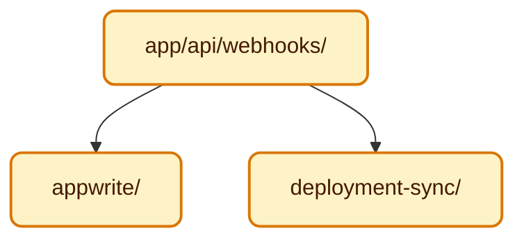

# Project Map — app/api/webhooks

```mermaid
flowchart TB
  classDef folder fill:#fef3c7,stroke:#d97706,stroke-width:2,color:#451a03,rx:8,ry:8
  classDef file fill:#f0fdf4,stroke:#65a30d,stroke-width:1.5,color:#422006,rx:4,ry:4
  app_api_webhooks["app/api/webhooks/" ]
  class app_api_webhooks folder
  app_api_webhooks_appwrite["appwrite/"]
  class app_api_webhooks_appwrite folder
  app_api_webhooks --> app_api_webhooks_appwrite
  app_api_webhooks_deployment_sync["deployment-sync/"]
  class app_api_webhooks_deployment_sync folder
  app_api_webhooks --> app_api_webhooks_deployment_sync
```
