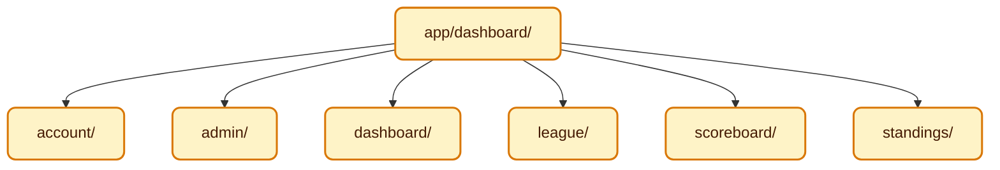

# Project Map — app/dashboard

```mermaid
flowchart TB
  classDef folder fill:#fef3c7,stroke:#d97706,stroke-width:2,color:#451a03,rx:8,ry:8
  classDef file fill:#f0fdf4,stroke:#65a30d,stroke-width:1.5,color:#422006,rx:4,ry:4
  app_dashboard["app/dashboard/" ]
  class app_dashboard folder
  app_dashboard_account["account/"]
  class app_dashboard_account folder
  app_dashboard --> app_dashboard_account
  click app_dashboard_account "/admin/project-map/app/dashboard/account" "Open account"
  app_dashboard_admin["admin/"]
  class app_dashboard_admin folder
  app_dashboard --> app_dashboard_admin
  click app_dashboard_admin "/admin/project-map/app/dashboard/admin" "Open admin"
  app_dashboard_dashboard["dashboard/"]
  class app_dashboard_dashboard folder
  app_dashboard --> app_dashboard_dashboard
  click app_dashboard_dashboard "/admin/project-map/app/dashboard/dashboard" "Open dashboard"
  app_dashboard_league["league/"]
  class app_dashboard_league folder
  app_dashboard --> app_dashboard_league
  click app_dashboard_league "/admin/project-map/app/dashboard/league" "Open league"
  app_dashboard_scoreboard["scoreboard/"]
  class app_dashboard_scoreboard folder
  app_dashboard --> app_dashboard_scoreboard
  click app_dashboard_scoreboard "/admin/project-map/app/dashboard/scoreboard" "Open scoreboard"
  app_dashboard_standings["standings/"]
  class app_dashboard_standings folder
  app_dashboard --> app_dashboard_standings
  click app_dashboard_standings "/admin/project-map/app/dashboard/standings" "Open standings"
```
