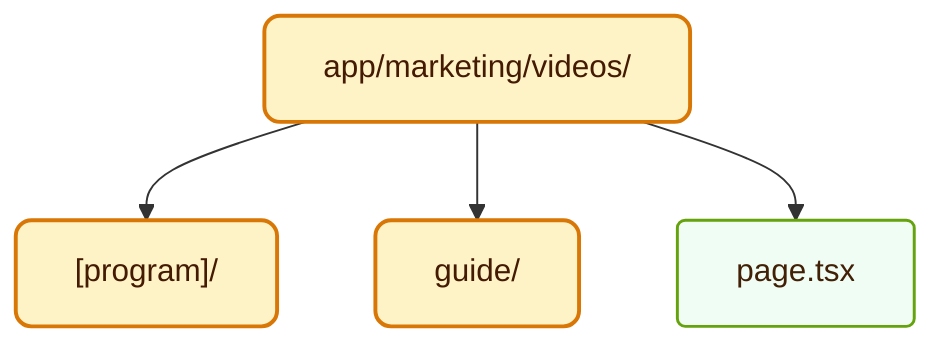

# Project Map — app/marketing/videos

```mermaid
flowchart TB
  classDef folder fill:#fef3c7,stroke:#d97706,stroke-width:2,color:#451a03,rx:8,ry:8
  classDef file fill:#f0fdf4,stroke:#65a30d,stroke-width:1.5,color:#422006,rx:4,ry:4
  app_marketing_videos["app/marketing/videos/" ]
  class app_marketing_videos folder
  app_marketing_videos__program_["[program]/"]
  class app_marketing_videos__program_ folder
  app_marketing_videos --> app_marketing_videos__program_
  app_marketing_videos_guide["guide/"]
  class app_marketing_videos_guide folder
  app_marketing_videos --> app_marketing_videos_guide
  app_marketing_videos_page_tsx["page.tsx"]
  class app_marketing_videos_page_tsx file
  app_marketing_videos --> app_marketing_videos_page_tsx
```
