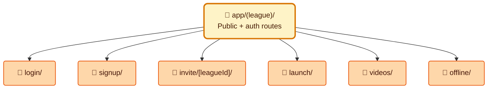

# Project Map — app/(league)

```mermaid
flowchart TB
  classDef folder fill:#dbeafe,stroke:#2563eb,stroke-width:2,color:#1e293b,rx:8,ry:8
  classDef file fill:#fed7aa,stroke:#ea580c,stroke-width:1.5,color:#431407,rx:4,ry:4
  classDef highlight fill:#fef3c7,stroke:#d97706,stroke-width:3,color:#451a03,rx:8,ry:8

  R["📁 app/(league)/<br/>Public + auth routes"]:::highlight

  login["📄 login/"]:::file
  signup["📄 signup/"]:::file
  invite["📄 invite/[leagueId]/"]:::file
  videos["📄 videos/"]:::file
  launch["📄 launch/"]:::file
  offline["📄 offline/"]:::file

  R --> login
  R --> signup
  R --> invite
  R --> launch
  R --> videos
  R --> offline
```
