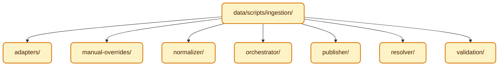

# Project Map — data/scripts/ingestion

```mermaid
flowchart TB
  classDef folder fill:#fef3c7,stroke:#d97706,stroke-width:2,color:#451a03,rx:8,ry:8
  classDef file fill:#f0fdf4,stroke:#65a30d,stroke-width:1.5,color:#422006,rx:4,ry:4
  data_scripts_ingestion["data/scripts/ingestion/" ]
  class data_scripts_ingestion folder
  data_scripts_ingestion_adapters["adapters/"]
  class data_scripts_ingestion_adapters folder
  data_scripts_ingestion --> data_scripts_ingestion_adapters
  data_scripts_ingestion_manual_overrides["manual-overrides/"]
  class data_scripts_ingestion_manual_overrides folder
  data_scripts_ingestion --> data_scripts_ingestion_manual_overrides
  data_scripts_ingestion_normalizer["normalizer/"]
  class data_scripts_ingestion_normalizer folder
  data_scripts_ingestion --> data_scripts_ingestion_normalizer
  data_scripts_ingestion_orchestrator["orchestrator/"]
  class data_scripts_ingestion_orchestrator folder
  data_scripts_ingestion --> data_scripts_ingestion_orchestrator
  data_scripts_ingestion_publisher["publisher/"]
  class data_scripts_ingestion_publisher folder
  data_scripts_ingestion --> data_scripts_ingestion_publisher
  data_scripts_ingestion_resolver["resolver/"]
  class data_scripts_ingestion_resolver folder
  data_scripts_ingestion --> data_scripts_ingestion_resolver
  data_scripts_ingestion_validation["validation/"]
  class data_scripts_ingestion_validation folder
  data_scripts_ingestion --> data_scripts_ingestion_validation
```
