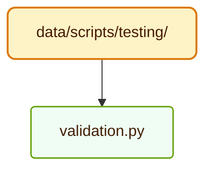

# Project Map — data/scripts/testing

```mermaid
flowchart TB
  classDef folder fill:#fef3c7,stroke:#d97706,stroke-width:2,color:#451a03,rx:8,ry:8
  classDef file fill:#f0fdf4,stroke:#65a30d,stroke-width:1.5,color:#422006,rx:4,ry:4
  data_scripts_testing["data/scripts/testing/" ]
  class data_scripts_testing folder
  data_scripts_testing_validation_py["validation.py"]
  class data_scripts_testing_validation_py file
  data_scripts_testing --> data_scripts_testing_validation_py
```
