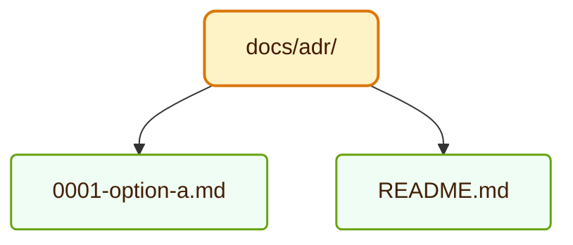

# Project Map — docs/adr

```mermaid
flowchart TB
  classDef folder fill:#fef3c7,stroke:#d97706,stroke-width:2,color:#451a03,rx:8,ry:8
  classDef file fill:#f0fdf4,stroke:#65a30d,stroke-width:1.5,color:#422006,rx:4,ry:4
  docs_adr["docs/adr/" ]
  class docs_adr folder
  docs_adr_0001_option_a_md["0001-option-a.md"]
  class docs_adr_0001_option_a_md file
  docs_adr --> docs_adr_0001_option_a_md
  docs_adr_README_md["README.md"]
  class docs_adr_README_md file
  docs_adr --> docs_adr_README_md
```
