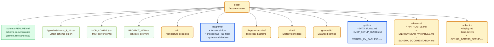

# Project Map — docs

```mermaid
flowchart TB
  classDef folder fill:#fef3c7,stroke:#d97706,stroke-width:2,color:#451a03,rx:8,ry:8
  classDef file fill:#f0fdf4,stroke:#65a30d,stroke-width:1.5,color:#422006,rx:4,ry:4
  classDef highlight fill:#dbeafe,stroke:#2563eb,stroke-width:3,color:#1e293b
  classDef updated fill:#dcfce7,stroke:#16a34a,stroke-width:2,color:#14532d
  
  R["docs/<br/>Documentation"]
  class R folder
  
  %% Key files
  schema_readme["schema-README.md<br/>Schema documentation<br/>(camelCase canonical)"]
  class schema_readme updated
  R --> schema_readme
  
  appwrite_schema["AppwriteSchema_8_24.csv<br/>Latest schema export"]
  class appwrite_schema file
  R --> appwrite_schema
  
  mcp_config["MCP_CONFIG.json<br/>MCP server config"]
  class mcp_config file
  R --> mcp_config
  
  project_map_md["PROJECT_MAP.md<br/>High-level overview"]
  class project_map_md file
  R --> project_map_md
  
  %% Folders
  docs_adr_["adr/<br/>Architecture decisions"]
  class docs_adr_ folder
  R --> docs_adr_
  
  docs_diagrams_["diagrams/<br/>• functional-flow<br/>• project-map (436 files)<br/>• system-architecture"]
  class docs_diagrams_ highlight
  R --> docs_diagrams_
  click docs_diagrams_ "/admin/project-map/docs/diagrams" "Open diagrams"
  
  docs_diagrams_archive_["diagrams-archive/<br/>Historical diagrams"]
  class docs_diagrams_archive_ folder
  R --> docs_diagrams_archive_
  
  docs_draft_["draft/<br/>Draft system docs"]
  class docs_draft_ folder
  R --> docs_draft_
  
  docs_guardrails_["guardrails/<br/>Data feed configs"]
  class docs_guardrails_ folder
  R --> docs_guardrails_
  
  docs_guides_["guides/<br/>• DATA_FLOW.md<br/>• MCP_SETUP_GUIDE.md<br/>• VERCEL_KV_CACHING.md"]
  class docs_guides_ highlight
  R --> docs_guides_
  click docs_guides_ "/admin/project-map/docs/guides" "Open guides"
  
  docs_reference_["reference/<br/>• API_ROUTES.md<br/>• ENVIRONMENT_VARIABLES.md<br/>• SCHEMA_DOCUMENTATION.md"]
  class docs_reference_ folder
  R --> docs_reference_
  click docs_reference_ "/admin/project-map/docs/reference" "Open reference"
  
  docs_runbooks_["runbooks/<br/>• deploy.md<br/>• local-dev.md<br/>• GITHUB_ACCESS_SETUP.md"]
  class docs_runbooks_ folder
  R --> docs_runbooks_
  click docs_runbooks_ "/admin/project-map/docs/runbooks" "Open runbooks"
```
