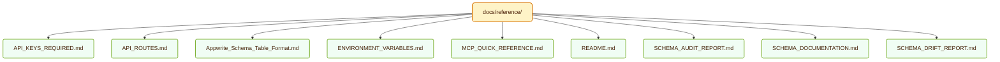

# Project Map — docs/reference

```mermaid
flowchart TB
  classDef folder fill:#fef3c7,stroke:#d97706,stroke-width:2,color:#451a03,rx:8,ry:8
  classDef file fill:#f0fdf4,stroke:#65a30d,stroke-width:1.5,color:#422006,rx:4,ry:4
  docs_reference["docs/reference/" ]
  class docs_reference folder
  docs_reference_API_KEYS_REQUIRED_md["API_KEYS_REQUIRED.md"]
  class docs_reference_API_KEYS_REQUIRED_md file
  docs_reference --> docs_reference_API_KEYS_REQUIRED_md
  docs_reference_API_ROUTES_md["API_ROUTES.md"]
  class docs_reference_API_ROUTES_md file
  docs_reference --> docs_reference_API_ROUTES_md
  docs_reference_Appwrite_Schema_Table_Format_md["Appwrite_Schema_Table_Format.md"]
  class docs_reference_Appwrite_Schema_Table_Format_md file
  docs_reference --> docs_reference_Appwrite_Schema_Table_Format_md
  docs_reference_ENVIRONMENT_VARIABLES_md["ENVIRONMENT_VARIABLES.md"]
  class docs_reference_ENVIRONMENT_VARIABLES_md file
  docs_reference --> docs_reference_ENVIRONMENT_VARIABLES_md
  docs_reference_MCP_QUICK_REFERENCE_md["MCP_QUICK_REFERENCE.md"]
  class docs_reference_MCP_QUICK_REFERENCE_md file
  docs_reference --> docs_reference_MCP_QUICK_REFERENCE_md
  docs_reference_README_md["README.md"]
  class docs_reference_README_md file
  docs_reference --> docs_reference_README_md
  docs_reference_SCHEMA_AUDIT_REPORT_md["SCHEMA_AUDIT_REPORT.md"]
  class docs_reference_SCHEMA_AUDIT_REPORT_md file
  docs_reference --> docs_reference_SCHEMA_AUDIT_REPORT_md
  docs_reference_SCHEMA_DOCUMENTATION_md["SCHEMA_DOCUMENTATION.md"]
  class docs_reference_SCHEMA_DOCUMENTATION_md file
  docs_reference --> docs_reference_SCHEMA_DOCUMENTATION_md
  docs_reference_SCHEMA_DRIFT_REPORT_md["SCHEMA_DRIFT_REPORT.md"]
  class docs_reference_SCHEMA_DRIFT_REPORT_md file
  docs_reference --> docs_reference_SCHEMA_DRIFT_REPORT_md
```
