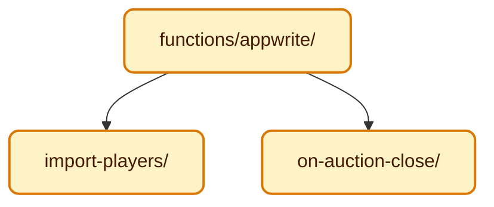

# Project Map — functions/appwrite

```mermaid
flowchart TB
  classDef folder fill:#fef3c7,stroke:#d97706,stroke-width:2,color:#451a03,rx:8,ry:8
  classDef file fill:#f0fdf4,stroke:#65a30d,stroke-width:1.5,color:#422006,rx:4,ry:4
  functions_appwrite["functions/appwrite/" ]
  class functions_appwrite folder
  functions_appwrite_import_players["import-players/"]
  class functions_appwrite_import_players folder
  functions_appwrite --> functions_appwrite_import_players
  click functions_appwrite_import_players "/admin/project-map/functions/appwrite/import-players" "Open import-players"
  functions_appwrite_on_auction_close["on-auction-close/"]
  class functions_appwrite_on_auction_close folder
  functions_appwrite --> functions_appwrite_on_auction_close
  click functions_appwrite_on_auction_close "/admin/project-map/functions/appwrite/on-auction-close" "Open on-auction-close"
```
