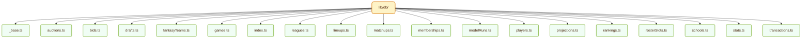

# Project Map — lib/db

```mermaid
flowchart TB
  classDef folder fill:#fef3c7,stroke:#d97706,stroke-width:2,color:#451a03,rx:8,ry:8
  classDef file fill:#f0fdf4,stroke:#65a30d,stroke-width:1.5,color:#422006,rx:4,ry:4
  lib_db["lib/db/" ]
  class lib_db folder
  lib_db__base_ts["_base.ts"]
  class lib_db__base_ts file
  lib_db --> lib_db__base_ts
  lib_db_auctions_ts["auctions.ts"]
  class lib_db_auctions_ts file
  lib_db --> lib_db_auctions_ts
  lib_db_bids_ts["bids.ts"]
  class lib_db_bids_ts file
  lib_db --> lib_db_bids_ts
  lib_db_drafts_ts["drafts.ts"]
  class lib_db_drafts_ts file
  lib_db --> lib_db_drafts_ts
  lib_db_fantasyTeams_ts["fantasyTeams.ts"]
  class lib_db_fantasyTeams_ts file
  lib_db --> lib_db_fantasyTeams_ts
  lib_db_games_ts["games.ts"]
  class lib_db_games_ts file
  lib_db --> lib_db_games_ts
  lib_db_index_ts["index.ts"]
  class lib_db_index_ts file
  lib_db --> lib_db_index_ts
  lib_db_leagues_ts["leagues.ts"]
  class lib_db_leagues_ts file
  lib_db --> lib_db_leagues_ts
  lib_db_lineups_ts["lineups.ts"]
  class lib_db_lineups_ts file
  lib_db --> lib_db_lineups_ts
  lib_db_matchups_ts["matchups.ts"]
  class lib_db_matchups_ts file
  lib_db --> lib_db_matchups_ts
  lib_db_memberships_ts["memberships.ts"]
  class lib_db_memberships_ts file
  lib_db --> lib_db_memberships_ts
  lib_db_modelRuns_ts["modelRuns.ts"]
  class lib_db_modelRuns_ts file
  lib_db --> lib_db_modelRuns_ts
  lib_db_players_ts["players.ts"]
  class lib_db_players_ts file
  lib_db --> lib_db_players_ts
  lib_db_projections_ts["projections.ts"]
  class lib_db_projections_ts file
  lib_db --> lib_db_projections_ts
  lib_db_rankings_ts["rankings.ts"]
  class lib_db_rankings_ts file
  lib_db --> lib_db_rankings_ts
  lib_db_rosterSlots_ts["rosterSlots.ts"]
  class lib_db_rosterSlots_ts file
  lib_db --> lib_db_rosterSlots_ts
  lib_db_schools_ts["schools.ts"]
  class lib_db_schools_ts file
  lib_db --> lib_db_schools_ts
  lib_db_stats_ts["stats.ts"]
  class lib_db_stats_ts file
  lib_db --> lib_db_stats_ts
  lib_db_transactions_ts["transactions.ts"]
  class lib_db_transactions_ts file
  lib_db --> lib_db_transactions_ts
```
