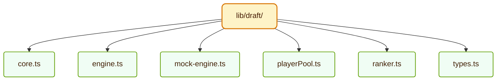

# Project Map — lib/draft

```mermaid
flowchart TB
  classDef folder fill:#fef3c7,stroke:#d97706,stroke-width:2,color:#451a03,rx:8,ry:8
  classDef file fill:#f0fdf4,stroke:#65a30d,stroke-width:1.5,color:#422006,rx:4,ry:4
  lib_draft["lib/draft/" ]
  class lib_draft folder
  lib_draft_core_ts["core.ts"]
  class lib_draft_core_ts file
  lib_draft --> lib_draft_core_ts
  lib_draft_engine_ts["engine.ts"]
  class lib_draft_engine_ts file
  lib_draft --> lib_draft_engine_ts
  lib_draft_mock_engine_ts["mock-engine.ts"]
  class lib_draft_mock_engine_ts file
  lib_draft --> lib_draft_mock_engine_ts
  lib_draft_playerPool_ts["playerPool.ts"]
  class lib_draft_playerPool_ts file
  lib_draft --> lib_draft_playerPool_ts
  lib_draft_ranker_ts["ranker.ts"]
  class lib_draft_ranker_ts file
  lib_draft --> lib_draft_ranker_ts
  lib_draft_types_ts["types.ts"]
  class lib_draft_types_ts file
  lib_draft --> lib_draft_types_ts
```
