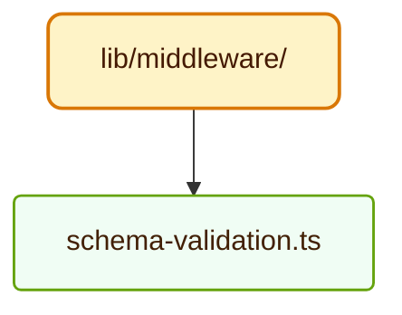

# Project Map — lib/middleware

```mermaid
flowchart TB
  classDef folder fill:#fef3c7,stroke:#d97706,stroke-width:2,color:#451a03,rx:8,ry:8
  classDef file fill:#f0fdf4,stroke:#65a30d,stroke-width:1.5,color:#422006,rx:4,ry:4
  lib_middleware["lib/middleware/" ]
  class lib_middleware folder
  lib_middleware_schema_validation_ts["schema-validation.ts"]
  class lib_middleware_schema_validation_ts file
  lib_middleware --> lib_middleware_schema_validation_ts
```
