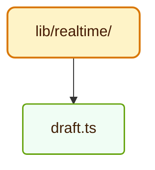

# Project Map — lib/realtime

```mermaid
flowchart TB
  classDef folder fill:#fef3c7,stroke:#d97706,stroke-width:2,color:#451a03,rx:8,ry:8
  classDef file fill:#f0fdf4,stroke:#65a30d,stroke-width:1.5,color:#422006,rx:4,ry:4
  lib_realtime["lib/realtime/" ]
  class lib_realtime folder
  lib_realtime_draft_ts["draft.ts"]
  class lib_realtime_draft_ts file
  lib_realtime --> lib_realtime_draft_ts
```
