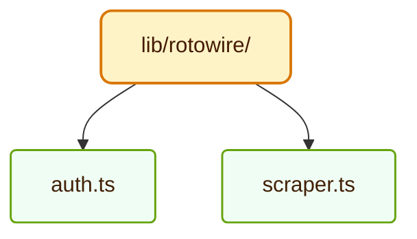

# Project Map — lib/rotowire

```mermaid
flowchart TB
  classDef folder fill:#fef3c7,stroke:#d97706,stroke-width:2,color:#451a03,rx:8,ry:8
  classDef file fill:#f0fdf4,stroke:#65a30d,stroke-width:1.5,color:#422006,rx:4,ry:4
  lib_rotowire["lib/rotowire/" ]
  class lib_rotowire folder
  lib_rotowire_auth_ts["auth.ts"]
  class lib_rotowire_auth_ts file
  lib_rotowire --> lib_rotowire_auth_ts
  lib_rotowire_scraper_ts["scraper.ts"]
  class lib_rotowire_scraper_ts file
  lib_rotowire --> lib_rotowire_scraper_ts
```
