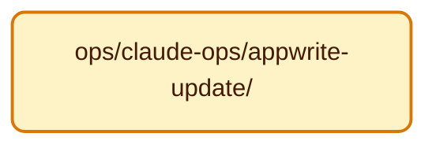

# Project Map — ops/claude-ops/appwrite-update

```mermaid
flowchart TB
  classDef folder fill:#fef3c7,stroke:#d97706,stroke-width:2,color:#451a03,rx:8,ry:8
  classDef file fill:#f0fdf4,stroke:#65a30d,stroke-width:1.5,color:#422006,rx:4,ry:4
  ops_claude_ops_appwrite_update["ops/claude-ops/appwrite-update/" ]
  class ops_claude_ops_appwrite_update folder
```
