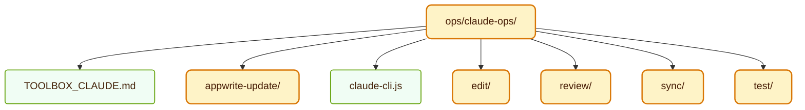

# Project Map — ops/claude-ops

```mermaid
flowchart TB
  classDef folder fill:#fef3c7,stroke:#d97706,stroke-width:2,color:#451a03,rx:8,ry:8
  classDef file fill:#f0fdf4,stroke:#65a30d,stroke-width:1.5,color:#422006,rx:4,ry:4
  ops_claude_ops["ops/claude-ops/" ]
  class ops_claude_ops folder
  ops_claude_ops_TOOLBOX_CLAUDE_md["TOOLBOX_CLAUDE.md"]
  class ops_claude_ops_TOOLBOX_CLAUDE_md file
  ops_claude_ops --> ops_claude_ops_TOOLBOX_CLAUDE_md
  ops_claude_ops_appwrite_update["appwrite-update/"]
  class ops_claude_ops_appwrite_update folder
  ops_claude_ops --> ops_claude_ops_appwrite_update
  click ops_claude_ops_appwrite_update "/admin/project-map/ops/claude-ops/appwrite-update" "Open appwrite-update"
  ops_claude_ops_claude_cli_js["claude-cli.js"]
  class ops_claude_ops_claude_cli_js file
  ops_claude_ops --> ops_claude_ops_claude_cli_js
  ops_claude_ops_edit["edit/"]
  class ops_claude_ops_edit folder
  ops_claude_ops --> ops_claude_ops_edit
  click ops_claude_ops_edit "/admin/project-map/ops/claude-ops/edit" "Open edit"
  ops_claude_ops_review["review/"]
  class ops_claude_ops_review folder
  ops_claude_ops --> ops_claude_ops_review
  click ops_claude_ops_review "/admin/project-map/ops/claude-ops/review" "Open review"
  ops_claude_ops_sync["sync/"]
  class ops_claude_ops_sync folder
  ops_claude_ops --> ops_claude_ops_sync
  click ops_claude_ops_sync "/admin/project-map/ops/claude-ops/sync" "Open sync"
  ops_claude_ops_test["test/"]
  class ops_claude_ops_test folder
  ops_claude_ops --> ops_claude_ops_test
  click ops_claude_ops_test "/admin/project-map/ops/claude-ops/test" "Open test"
```
