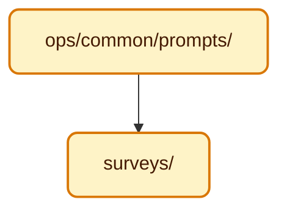

# Project Map — ops/common/prompts

```mermaid
flowchart TB
  classDef folder fill:#fef3c7,stroke:#d97706,stroke-width:2,color:#451a03,rx:8,ry:8
  classDef file fill:#f0fdf4,stroke:#65a30d,stroke-width:1.5,color:#422006,rx:4,ry:4
  ops_common_prompts["ops/common/prompts/" ]
  class ops_common_prompts folder
  ops_common_prompts_surveys["surveys/"]
  class ops_common_prompts_surveys folder
  ops_common_prompts --> ops_common_prompts_surveys
```
