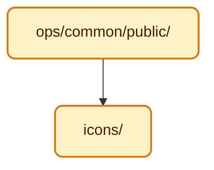

# Project Map — ops/common/public

```mermaid
flowchart TB
  classDef folder fill:#fef3c7,stroke:#d97706,stroke-width:2,color:#451a03,rx:8,ry:8
  classDef file fill:#f0fdf4,stroke:#65a30d,stroke-width:1.5,color:#422006,rx:4,ry:4
  ops_common_public["ops/common/public/" ]
  class ops_common_public folder
  ops_common_public_icons["icons/"]
  class ops_common_public_icons folder
  ops_common_public --> ops_common_public_icons
```
