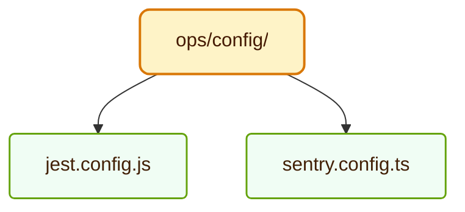

# Project Map — ops/config

```mermaid
flowchart TB
  classDef folder fill:#fef3c7,stroke:#d97706,stroke-width:2,color:#451a03,rx:8,ry:8
  classDef file fill:#f0fdf4,stroke:#65a30d,stroke-width:1.5,color:#422006,rx:4,ry:4
  ops_config["ops/config/" ]
  class ops_config folder
  ops_config_jest_config_js["jest.config.js"]
  class ops_config_jest_config_js file
  ops_config --> ops_config_jest_config_js
  ops_config_sentry_config_ts["sentry.config.ts"]
  class ops_config_sentry_config_ts file
  ops_config --> ops_config_sentry_config_ts
```
