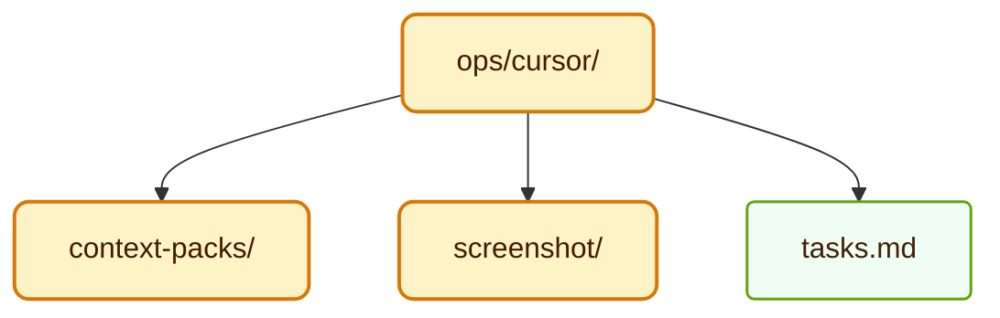

# Project Map — ops/cursor

```mermaid
flowchart TB
  classDef folder fill:#fef3c7,stroke:#d97706,stroke-width:2,color:#451a03,rx:8,ry:8
  classDef file fill:#f0fdf4,stroke:#65a30d,stroke-width:1.5,color:#422006,rx:4,ry:4
  ops_cursor["ops/cursor/" ]
  class ops_cursor folder
  ops_cursor_context_packs["context-packs/"]
  class ops_cursor_context_packs folder
  ops_cursor --> ops_cursor_context_packs
  click ops_cursor_context_packs "/admin/project-map/ops/cursor/context-packs" "Open context-packs"
  ops_cursor_screenshot["screenshot/"]
  class ops_cursor_screenshot folder
  ops_cursor --> ops_cursor_screenshot
  click ops_cursor_screenshot "/admin/project-map/ops/cursor/screenshot" "Open screenshot"
  ops_cursor_tasks_md["tasks.md"]
  class ops_cursor_tasks_md file
  ops_cursor --> ops_cursor_tasks_md
```
