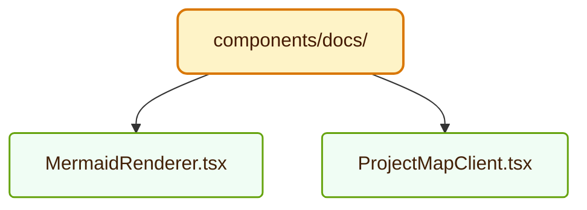

# Project Map — components/docs

```mermaid
flowchart TB
  classDef folder fill:#fef3c7,stroke:#d97706,stroke-width:2,color:#451a03,rx:8,ry:8
  classDef file fill:#f0fdf4,stroke:#65a30d,stroke-width:1.5,color:#422006,rx:4,ry:4
  components_docs["components/docs/" ]
  class components_docs folder
  components_docs_MermaidRenderer_tsx["MermaidRenderer.tsx"]
  class components_docs_MermaidRenderer_tsx file
  components_docs --> components_docs_MermaidRenderer_tsx
  components_docs_ProjectMapClient_tsx["ProjectMapClient.tsx"]
  class components_docs_ProjectMapClient_tsx file
  components_docs --> components_docs_ProjectMapClient_tsx
```
