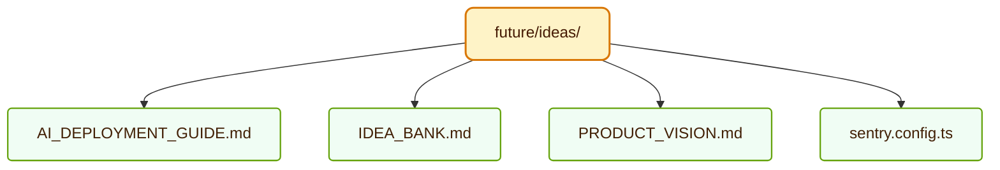

# Project Map — future/ideas

```mermaid
flowchart TB
  classDef folder fill:#fef3c7,stroke:#d97706,stroke-width:2,color:#451a03,rx:8,ry:8
  classDef file fill:#f0fdf4,stroke:#65a30d,stroke-width:1.5,color:#422006,rx:4,ry:4
  future_ideas["future/ideas/" ]
  class future_ideas folder
  future_ideas_AI_DEPLOYMENT_GUIDE_md["AI_DEPLOYMENT_GUIDE.md"]
  class future_ideas_AI_DEPLOYMENT_GUIDE_md file
  future_ideas --> future_ideas_AI_DEPLOYMENT_GUIDE_md
  future_ideas_IDEA_BANK_md["IDEA_BANK.md"]
  class future_ideas_IDEA_BANK_md file
  future_ideas --> future_ideas_IDEA_BANK_md
  future_ideas_PRODUCT_VISION_md["PRODUCT_VISION.md"]
  class future_ideas_PRODUCT_VISION_md file
  future_ideas --> future_ideas_PRODUCT_VISION_md
  future_ideas_sentry_config_ts["sentry.config.ts"]
  class future_ideas_sentry_config_ts file
  future_ideas --> future_ideas_sentry_config_ts
```
