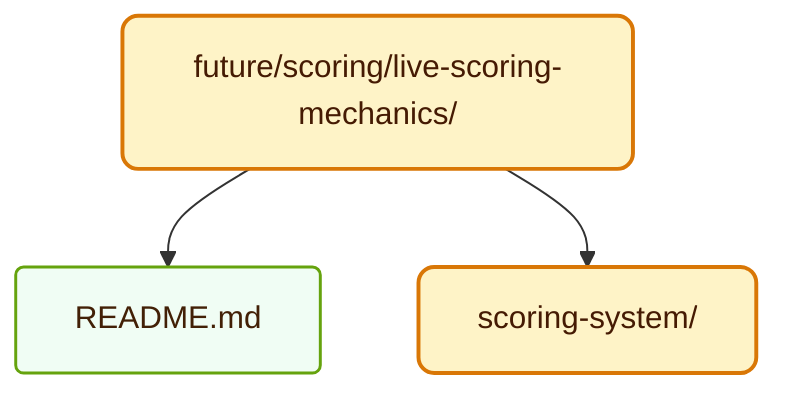

# Project Map — future/scoring/live-scoring-mechanics

```mermaid
flowchart TB
  classDef folder fill:#fef3c7,stroke:#d97706,stroke-width:2,color:#451a03,rx:8,ry:8
  classDef file fill:#f0fdf4,stroke:#65a30d,stroke-width:1.5,color:#422006,rx:4,ry:4
  future_scoring_live_scoring_mechanics["future/scoring/live-scoring-mechanics/" ]
  class future_scoring_live_scoring_mechanics folder
  future_scoring_live_scoring_mechanics_README_md["README.md"]
  class future_scoring_live_scoring_mechanics_README_md file
  future_scoring_live_scoring_mechanics --> future_scoring_live_scoring_mechanics_README_md
  future_scoring_live_scoring_mechanics_scoring_system["scoring-system/"]
  class future_scoring_live_scoring_mechanics_scoring_system folder
  future_scoring_live_scoring_mechanics --> future_scoring_live_scoring_mechanics_scoring_system
```
