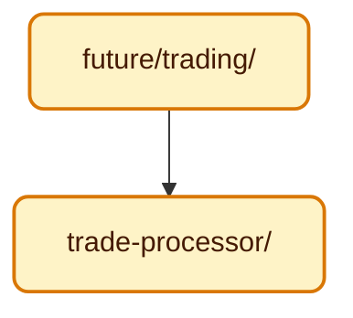

# Project Map — future/trading

```mermaid
flowchart TB
  classDef folder fill:#fef3c7,stroke:#d97706,stroke-width:2,color:#451a03,rx:8,ry:8
  classDef file fill:#f0fdf4,stroke:#65a30d,stroke-width:1.5,color:#422006,rx:4,ry:4
  future_trading["future/trading/" ]
  class future_trading folder
  future_trading_trade_processor["trade-processor/"]
  class future_trading_trade_processor folder
  future_trading --> future_trading_trade_processor
  click future_trading_trade_processor "/admin/project-map/future/trading/trade-processor" "Open trade-processor"
```
