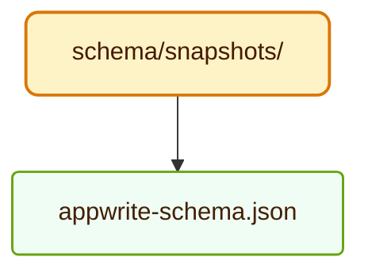

# Project Map — schema/snapshots

```mermaid
flowchart TB
  classDef folder fill:#fef3c7,stroke:#d97706,stroke-width:2,color:#451a03,rx:8,ry:8
  classDef file fill:#f0fdf4,stroke:#65a30d,stroke-width:1.5,color:#422006,rx:4,ry:4
  schema_snapshots["schema/snapshots/" ]
  class schema_snapshots folder
  schema_snapshots_appwrite_schema_json["appwrite-schema.json"]
  class schema_snapshots_appwrite_schema_json file
  schema_snapshots --> schema_snapshots_appwrite_schema_json
```
