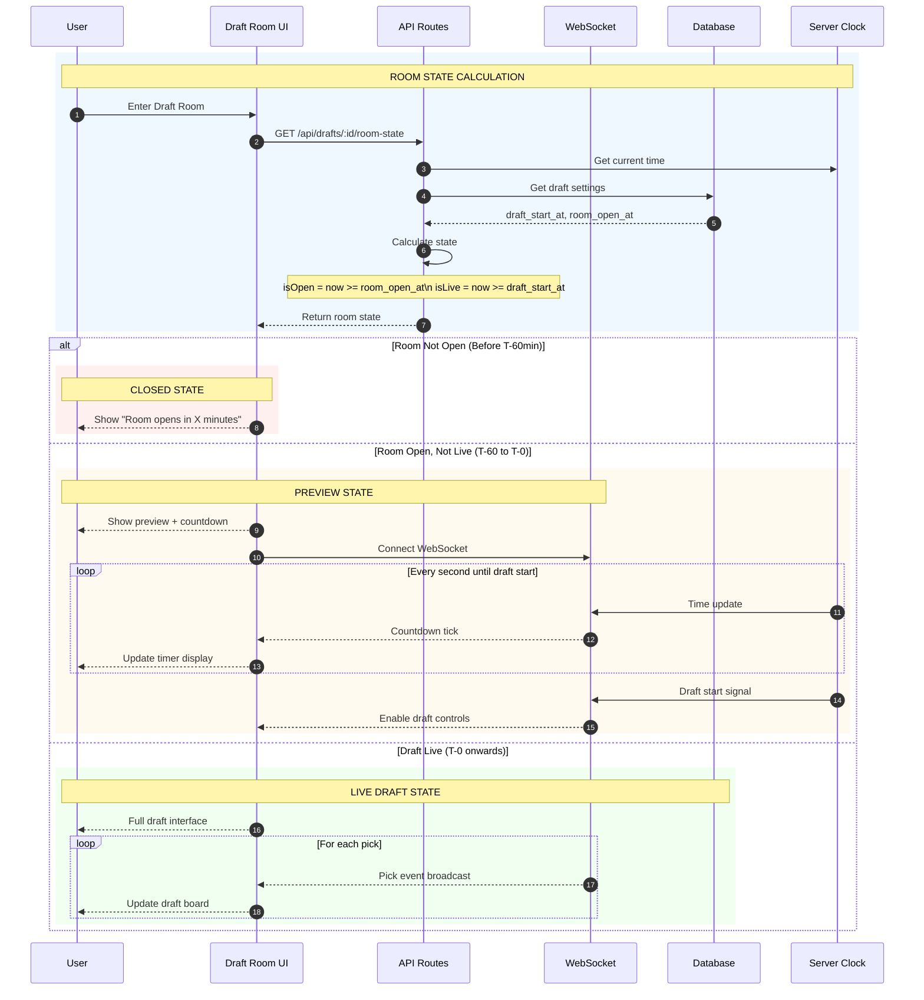

# Draft System Comparison & Timing Control

> Comparison of Mock vs Real drafts with timing control sequence.

## Notes
- No emojis; accessible colors in sequence blocks.
- Focuses on timing gates and realtime updates.
