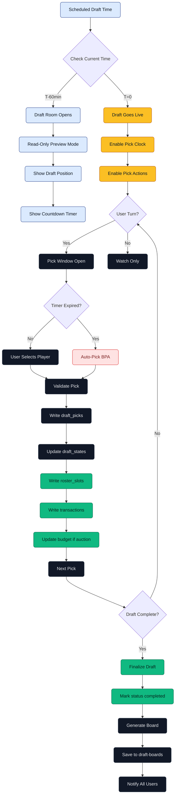

# Real Draft Flow (League Season)

> Official league draft with scheduled timing and season commitments.

## Notes
- No emojis; clear three-phase timing and season commitments.
- Auto-pick explicitly shown as a fallback on timer expiration.
- Colors chosen for accessibility and contrast on light background.
