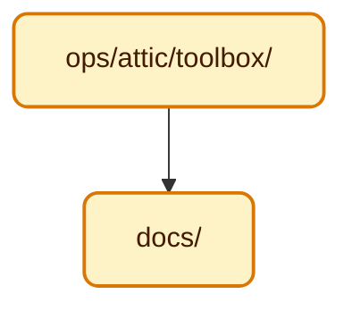

# Project Map — ops/attic/toolbox

```mermaid
flowchart TB
  classDef folder fill:#fef3c7,stroke:#d97706,stroke-width:2,color:#451a03,rx:8,ry:8
  classDef file fill:#f0fdf4,stroke:#65a30d,stroke-width:1.5,color:#422006,rx:4,ry:4
  ops_attic_toolbox["ops/attic/toolbox/" ]
  class ops_attic_toolbox folder
  ops_attic_toolbox_docs["docs/"]
  class ops_attic_toolbox_docs folder
  ops_attic_toolbox --> ops_attic_toolbox_docs
```
