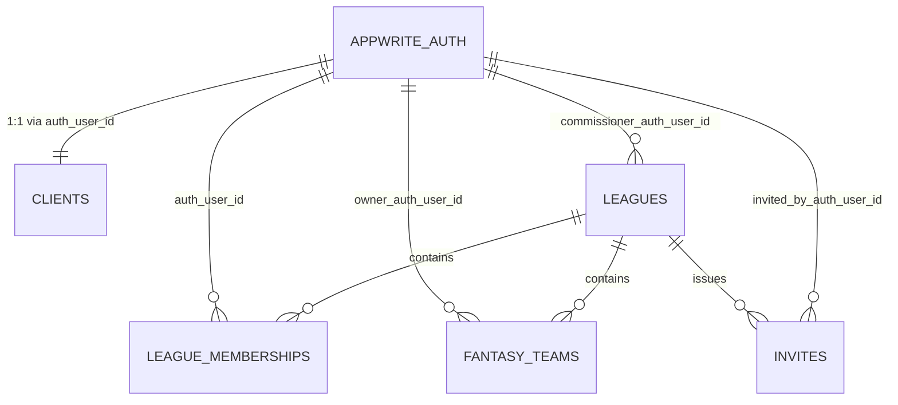

# League Ownership & Membership Model — **auth\_user\_id** Standardization

This aligns to your current direction: **use **``** everywhere** (leagues, memberships, and lookups into clients). Memberships remain the source of truth for league membership and roles; the league doc keeps a fast pointer to its commissioner.

---

## TL;DR

- **Leagues**: store `commissioner_auth_user_id` (string, indexed). No `client_id` needed.
- **League memberships**: canonical roster keyed by `(league_id, auth_user_id)` with `role` and `status`.
- **Clients**: profile store keyed by `auth_user_id` (bridge to names, avatars, email). Not referenced by id elsewhere.
- **Fantasy teams**: (recommended) add `owner_auth_user_id` and prefer it over any client-based key.

---

## Target Schema (per collection)

### `clients`

- `auth_user_id` **(string:64, unique)**
- `display_name`, `email`, `avatar_url`, etc.

> This is your profile store and the bridge from Appwrite Auth → app profile. You don’t need to reference `clients.$id` elsewhere if you standardize on `auth_user_id`.

### `leagues`

- `name` (string)
- `commissioner_auth_user_id` **(string:64, required, indexed)**
- `season`, `status`, `is_public`, `scoring_settings`, `waiver_settings`, ...
- **Indexes**: `IDX(commissioner_auth_user_id)` (often named `owner_idx`)

> Keep exactly one owner pointer on the league for fast filtering and permission checks.

### `league_memberships`

- `league_id` **(string:64, required, indexed)**
- `auth_user_id` **(string:64, required, indexed)**
- `role` **(string:16, required, indexed)**: `'COMMISSIONER' | 'MEMBER'`
- `status` (string:16): `'ACTIVE' | 'INVITED' | 'LEFT' | 'KICKED'`
- `joined_at` (datetime), optional `display_name` cache
- **Indexes**: `UNIQUE(league_id, auth_user_id)`, `IDX(league_id)`, `IDX(auth_user_id)`, `IDX(role)`

> Single source of truth for who is in the league and with what role. The league keeps a fast owner pointer.

### `fantasy_teams` (recommended alignment)

- `league_id` (string:64, indexed)
- `owner_auth_user_id` **(string:64, indexed)** ← add this if not present
- any team metadata (name, logo, etc.)

> Prefer `owner_auth_user_id` for consistency. You can keep a transitional `owner_client_id` during migration, then remove it.

### `invites`

- `league_id` (string:64, indexed)
- `email`
- `token` (string, unique)
- `status` (e.g., `PENDING | ACCEPTED | EXPIRED`)
- `invited_by_auth_user_id` (string:64, indexed)
- timestamps

> When an invite is accepted: ensure a `clients` profile exists for that `auth_user_id`, then insert a membership with `role='MEMBER'`.

---

## Creation & Join Flow (auth-only ids)

**Create League**

1. `auth_user_id = currentUser.$id`
2. Create `leagues` doc with `commissioner_auth_user_id = auth_user_id`
3. Create `league_memberships` doc: `{ league_id, auth_user_id, role:'COMMISSIONER', status:'ACTIVE', joined_at: now }`
4. (optional) Create a `fantasy_teams` doc `{ league_id, owner_auth_user_id }`

**Invite & Accept**

- Create `invites` with `invited_by_auth_user_id = currentUser.$id`
- On acceptance: find/create `clients` profile for accepted user → insert `league_memberships` with `role:'MEMBER', status:'ACTIVE'`

---

## Permissions (Appwrite examples)

**League document permissions**

```ts
[
  Permission.read(Role.any()),                       // if you allow public reads
  Permission.update(Role.user(commissionerId)),
  Permission.delete(Role.user(commissionerId)),
]
```

**Membership document permissions**

```ts
[
  Permission.read(Role.user(auth_user_id)),          // member can read their membership
  Permission.read(Role.user(commissionerId)),        // commissioner can read
  Permission.update(Role.user(commissionerId)),      // commissioner can manage
]
```

> You may also grant read to all league members (or to a `Team`/`Role` representing the league) if you want member-to-member visibility.

---

## Query Patterns

- **Leagues I run**

```ts
db.listDocuments('leagues', [Query.equal('commissioner_auth_user_id', currentUser.$id)])
```

- **My memberships**

```ts
db.listDocuments('league_memberships', [Query.equal('auth_user_id', currentUser.$id)])
```

- **Members of a league**

```ts
db.listDocuments('league_memberships', [
  Query.equal('league_id', leagueId),
  Query.equal('status', 'ACTIVE'),
])
```

- **Is current user the commissioner?**

```ts
league.commissioner_auth_user_id === currentUser.$id
// (optional consistency check)
exists membership where league_id=leagueId AND auth_user_id=currentUser.$id AND role='COMMISSIONER'
```

---

## Migration Plan (minimal, safe)

1. **Leagues**

- Add `commissioner_auth_user_id` (string:64, required, indexed)
- Backfill from the existing owner/commissioner source (resolve to auth ids)
- Point `owner_idx` at `commissioner_auth_user_id`
- Remove any name-based `commissioner` field after code cutover

2. **League memberships**

- Ensure `auth_user_id` is present for all rows
- Enforce `UNIQUE(league_id, auth_user_id)`

3. **Fantasy teams** (recommended)

- Add `owner_auth_user_id` and backfill from old owner field via `clients.auth_user_id`
- Switch reads/writes to `owner_auth_user_id`, then deprecate old owner field

4. **Invites**

- Normalize to `invited_by_auth_user_id` and standardize snake\_case naming

---

## Example Implementation (TypeScript-ish pseudocode)

```ts
const authUserId = currentUser.$id;

// 1) ensure clients profile exists (optional but nice)
await getOrCreateClientByAuthUserId(authUserId);

// 2) create league
const league = await db.createDocument('leagues', ID.unique(), {
  name,
  commissioner_auth_user_id: authUserId,
  // ...other settings
}, [
  Permission.read(Role.any()),
  Permission.update(Role.user(authUserId)),
  Permission.delete(Role.user(authUserId)),
]);

// 3) self-membership as commissioner
await db.createDocument('league_memberships', ID.unique(), {
  league_id: league.$id,
  auth_user_id: authUserId,
  role: 'COMMISSIONER',
  status: 'ACTIVE',
  joined_at: new Date().toISOString(),
}, [
  Permission.read(Role.user(authUserId)),
  Permission.update(Role.user(authUserId)),
]);

// 4) optional team bootstrap
await db.createDocument('fantasy_teams', ID.unique(), {
  league_id: league.$id,
  owner_auth_user_id: authUserId,
});
```

---

## Invariants / Consistency Checks

- Every `leagues.commissioner_auth_user_id` **must** have a matching membership with `role='COMMISSIONER'`.
- Enforce at most one active commissioner per league unless you explicitly support co-commissioners.
- `league_memberships` must satisfy `UNIQUE(league_id, auth_user_id)`.

---

## Future Extensions (easy with this model)

- **Co-commissioners / Admins**: add more membership rows with `role='COMMISSIONER'` or introduce `ADMIN`.
- **Ownership transfer**: update `leagues.commissioner_auth_user_id` + swap membership roles atomically.
- **Soft delete**: add `archived_at` / `deleted_at` stamps on leagues and memberships.

---

## Cursor-Ready Prompts (copy/paste)

**Task 1 — Schema Updates**

> Update Appwrite schema:
>
> - `leagues`: add `commissioner_auth_user_id (string:64 required)`, index `owner_idx` on it.
> - `league_memberships`: enforce `UNIQUE(league_id, auth_user_id)`; add indexes on `league_id`, `auth_user_id`, `role`.
> - `fantasy_teams`: add `owner_auth_user_id (string:64)` + index.
> - `invites`: rename/standardize to `invited_by_auth_user_id`.

**Task 2 — Backfill Scripts**

> Write a script to:
>
> 1. For each `league`, set `commissioner_auth_user_id` from your existing source (map names → `auth_user_id` via `clients` if needed).
> 2. For each `fantasy_teams` doc, set `owner_auth_user_id` using `clients.auth_user_id` mapping from the old owner field.

**Task 3 — API Adjustments**

> - `POST /api/leagues`: set `commissioner_auth_user_id = currentUser.$id` and create commissioner membership.
> - `GET /api/leagues/mine`: filter by `commissioner_auth_user_id`.
> - `GET /api/leagues/:id/members`: list `league_memberships` by `league_id`.
> - Update fantasy-team endpoints to use `owner_auth_user_id`.

**Task 4 — Permissions**

> Apply the document permissions shown above so commissioners can manage their leagues and memberships.

**Task 5 — Cleanup**

> After deploy & verification, remove any old name-based `commissioner` fields and client-based owner fields from code and schema.

---

## ERD — League & Memberships (auth\_user\_id Standardization)

Below are visual relationships using a Mermaid ER diagram (for boxes/arrows) plus an ASCII fallback.

### Mermaid ERD



**Legend**

- `||--||` one-to-one
- `||--o{` one-to-many (left side is the "one")

### Entities (key attributes)

- **APPWRITE\_AUTH**: `$id (auth_user_id)`
- **CLIENTS**: `auth_user_id (unique)`, profile fields (`display_name`, `email`, ...)
- **LEAGUES**: `$id`, `commissioner_auth_user_id`, `name`, `season`, `status`, settings...
- **LEAGUE\_MEMBERSHIPS**: `$id`, `league_id`, `auth_user_id`, `role`, `status`, `joined_at`
- **FANTASY\_TEAMS**: `$id`, `league_id`, `owner_auth_user_id`, team fields
- **INVITES**: `$id`, `league_id`, `email`, `token`, `status`, `invited_by_auth_user_id`, timestamps

### Relationship Notes

- A **League** has exactly **one** commissioner (`leagues.commissioner_auth_user_id`).
- A **League** has **many** memberships; each membership belongs to **one** league.
- An **Auth User** can have **many** memberships across leagues.
- A **Fantasy Team** belongs to **one** league and **one** auth user (owner).
- **Invites** belong to **one** league and are issued by **one** auth user.
- `clients` is a profile layer keyed by `auth_user_id`; business relations reference the **auth id** directly for standardization.

### ASCII Fallback

```
[APPWRITE_AUTH]
   $id = auth_user_id
        ||
        || 1:1
        \/
[CLIENTS] (auth_user_id unique)

[LEAGUES] --(commissioner_auth_user_id)--> [APPWRITE_AUTH]
     | \
     |  \ contains
     |   \------------------------------.
     v                                   \
[LEAGUE_MEMBERSHIPS] --(auth_user_id)--> [APPWRITE_AUTH]
     ^
     | contains (by league_id)
     |
[LEAGUES]

[LEAGUES] -- contains --> [FANTASY_TEAMS] --(owner_auth_user_id)--> [APPWRITE_AUTH]

[LEAGUES] -- issues --> [INVITES] --(invited_by_auth_user_id)--> [APPWRITE_AUTH]
```

### On-Delete / Consistency (recommended)

- **Delete League** → cascade delete (or archive) `LEAGUE_MEMBERSHIPS`, `FANTASY_TEAMS`, `INVITES`.
- **Delete Auth User** → *do not hard-delete domain docs*. Prefer soft-delete or ownership transfer:
  - If user is a commissioner: require transfer before delete.
  - If user is a member only: set memberships/status to `LEFT` and archive teams.
- **Invariants**
  - Exactly one active `COMMISSIONER` membership should exist per league (unless you support co-commissioners).
  - Enforce `UNIQUE(league_id, auth_user_id)` on memberships.

### High-Use Queries (recap)

- My leagues (commissioner): filter `leagues` by `commissioner_auth_user_id`.
- My memberships: filter `league_memberships` by `auth_user_id`.
- League → members: filter `league_memberships` by `league_id` + `status='ACTIVE'`.
- League → teams: filter `fantasy_teams` by `league_id`.

If you want a PNG export of this ERD or a variant that shows secondary indexes and unique constraints inline, say the word and I’ll add it here.
