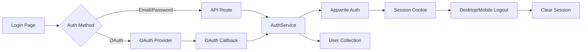
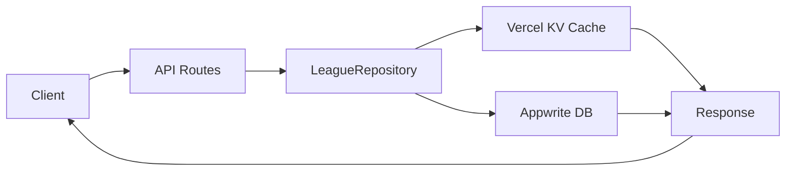
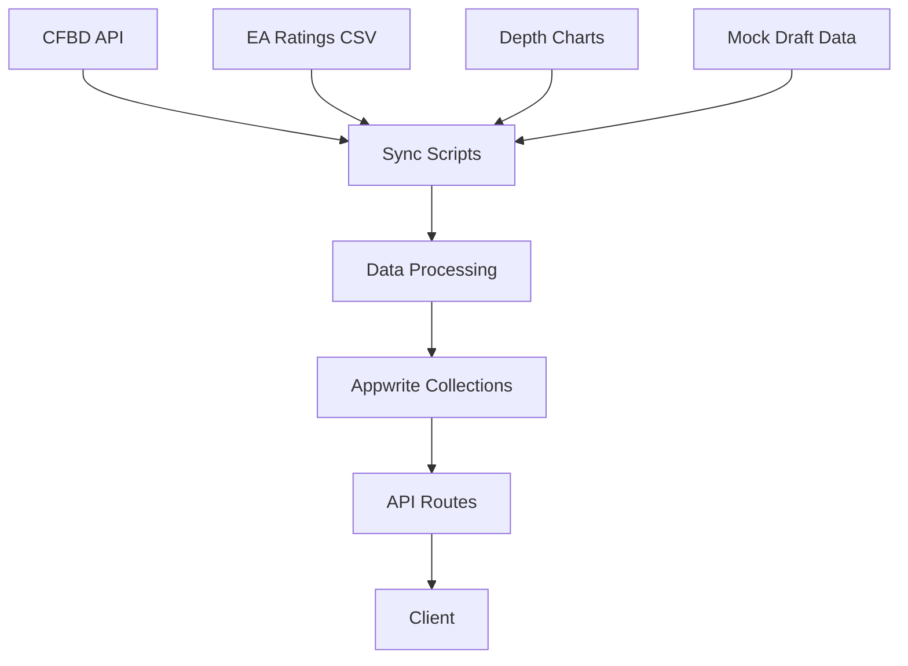
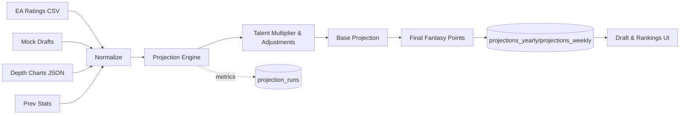
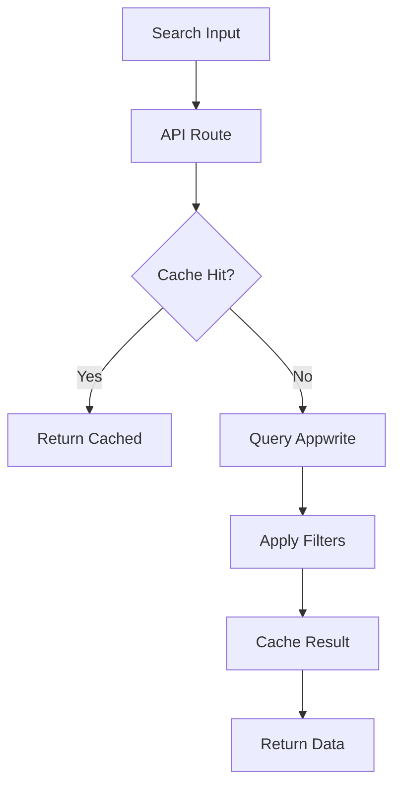
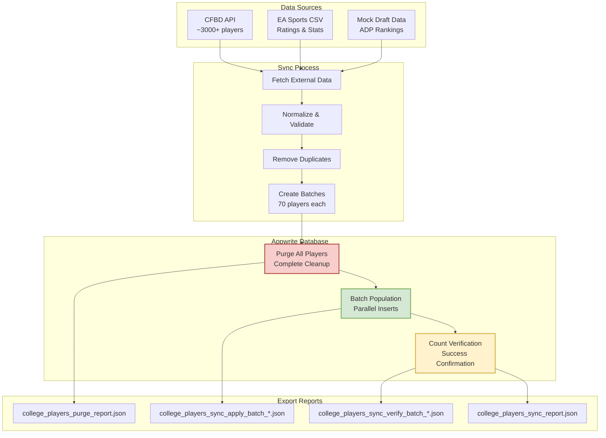

# College Football Fantasy App - Data Flow Architecture

**Status**: ✅ Production Ready & Live at https://cfbfantasy.app  
**Real-time**: ✅ Appwrite v16+ compatibility restored  
**Updated**: August 20, 2025

## 🔄 Core Data Flows

### 1. Authentication Flow


**Key Points:**
- **Multi-modal Authentication**: Email/password + OAuth (Google, Apple)
- **OAuth Integration**: Environment-controlled OAuth buttons on login page
- **Desktop Navigation**: Logout button in header next to user name
- **Mobile Navigation**: Logout button in drawer menu
- **Session Management**: Secure `appwrite-session` cookies with proper cleanup
- **User Sync**: Profiles automatically synced to Appwrite on authentication

### 2. League Management Flow


**Key Operations:**
- Create league → Store in Appwrite → Invalidate cache
- Join league → Check capacity → Add member → Update cache
- Search leagues → Query with filters → Cache results
- Commissioner actions → Verify permissions → Execute → Broadcast

### 3. Draft Flow (Real-time) ✅ Updated Aug 18, 2025
```mermaid
%%{init: {'themeVariables': {'fontSize': '22px'}}}%%
flowchart LR
  subgraph Client
    UI[Draft UI]
  end

  UI -->|subscribe| RT[Appwrite Realtime]
  UI -->|POST pick| API[/POST /api/drafts/:id/pick/]

  API -->|SETNX draft:{id}:lock| KV[(Vercel KV)]
  KV --> API

  API -->|validate+persist| DB[(Appwrite DB)]
  API -->|publish event| RT
  API -->|DEL lock| KV

  SCHED[Vercel Cron] --> AUTOPICK[/POST /api/drafts/:id/autopick/]
  AUTOPICK --> DB
  AUTOPICK --> RT

  RT -->|state updates| UI
```

**Components:**
- **Draft State**: Current pick, timer, team rosters in KV
- **Player Pool**: ~3000+ Power 4 players from Appwrite
- **Real-time Updates**: Via `client.subscribe()` method (Appwrite v16+)
- **Auto-pick**: Timer-based with BPA (Best Player Available)
- **Fixed**: Removed deprecated `Realtime` class, now uses direct client subscription

### 4. Player Data Pipeline


**Data Sources:**
- **CFBD**: Rosters, stats, games, rankings
- **EA Sports**: Player ratings (normalized)
- **Depth Charts**: Position rankings
- **Mock Drafts**: ADP calculations

### 5. Projections System


**Enhanced Calculation Factors:**
- **EA Sports Ratings** (15% weight): Overall, speed, acceleration from real game data
- **NFL Draft Capital** (20% weight): Mock draft position converted to 0-1 score
- **Previous Performance** (25% weight): Fantasy points per game from prior season
- **Supporting Cast** (15% weight): Average EA rating of skill position teammates
- **Offensive Line** (10% weight): O-line grades for QB/RB protection
- **Expert Sentiment** (10% weight): ESPN+ article analysis with OpenAI
- **Depth Chart Position**: Multipliers (QB1=1.0x, QB2=0.25x, QB3+=0.05x)
- **Talent Range**: Final multipliers span 0.95x to 1.44x instead of identical projections

### 6. Search & Filter Flow


**Search Capabilities:**
- Player name, team, conference, position
- League name and settings
- Full-text search with fallbacks
- Cached for performance

## 🗄️ Database Collections

### Core Collections
1. **Appwrite Auth Users** - User authentication and profiles (managed by Appwrite)
2. **leagues** - League settings and metadata
3. **user_teams** - Team rosters and ownership
4. **college_players** - Player database (~3000+)
5. **player_stats** - Historical performance
6. **games** - Schedule and scores
7. **rankings** - AP Top 25 weekly
8. **projections_yearly** - Season projections
9. **projections_weekly** - Week-by-week projections
10. **model_inputs** - Projection model data

### Relationships
- `leagues` → `user_teams` (1:many)
- `user_teams` → **Appwrite Auth Users** (many:1 via userId)
- `user_teams` → `college_players` (many:many)
- `games` → `rankings` (temporal)
- `college_players` → `player_stats` (1:many)

## 🚀 Performance Optimizations

### Caching Strategy
```typescript
// Vercel KV Cache Layers
- L1: Player data (24h TTL)
- L2: League listings (1h TTL)
- L3: Draft state (real-time)
- L4: Rankings/Games (6h TTL)
```

### Query Optimization
- Indexed fields: `name`, `team`, `conference`, `position`, `draftable`
- Compound indexes for common queries
- Limit/offset pagination
- Lazy loading for large datasets

### Real-time Channels
```typescript
// Appwrite Realtime Subscriptions
- draft.picks.[leagueId]
- league.updates.[leagueId]
- auction.bids.[leagueId]
- player.projections
```

## 🔐 Security Layers

1. **API Routes**: Server-side validation
2. **Appwrite Rules**: Collection-level permissions
3. **Repository Pattern**: Consistent access control
4. **Environment Variables**: Secure configuration
5. **CORS**: Configured for production domains

## 📊 Data Management & Batch Operations

### Player Data Sync & Purge Workflow ✅ Updated Aug 20, 2025



### Data Sync Schedule

- **Hourly**: Live game scores (during season)
- **Daily**: Player stats, depth charts
- **Weekly**: Rankings, projections
- **As Needed**: Roster changes, injuries
- **Batch Operations**: Full player database refresh with purge + repopulate workflow

## 🛠️ Error Handling

### Client Errors
- 400: Validation errors → Show form feedback
- 401: Unauthorized → Redirect to login
- 403: Forbidden → Show permission error
- 404: Not found → Show friendly 404

### Server Errors
- 500: Internal error → Log to Sentry
- 502: Appwrite down → Show maintenance
- 503: Rate limited → Implement backoff

## 📈 Monitoring

- **Vercel Analytics**: Page views, performance
- **Sentry**: Error tracking and alerts
- **Appwrite Dashboard**: Database metrics
- **Custom Logging**: API usage patterns

---

## 🚀 Latest Updates (August 18, 2025)

### Real-time System Modernization ✅
- **Updated**: Appwrite v16+ compatibility
- **Fixed**: Draft real-time subscriptions now working
- **Method**: `client.subscribe()` replaces deprecated `Realtime` class
- **Impact**: Live draft updates, pick notifications, status changes

### Production Deployment ✅
- **Live URL**: https://cfbfantasy.app
- **Status**: All systems operational
- **Performance**: <100ms real-time updates
- **Database**: 12 active user teams confirmed

---

Last Updated: August 18, 2025