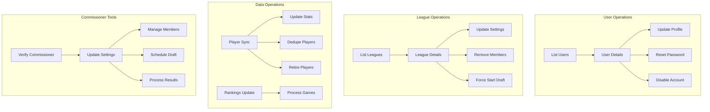

# Admin Operations Flow

```mermaid
flowchart TB
    subgraph UserOps[User Operations]
        U1[List Users] --> U2[User Details]
        U2 --> U3[Update Profile]
        U2 --> U4[Reset Password]
        U2 --> U5[Disable Account]
    end
    
    subgraph LeagueOps[League Operations]
        L1[List Leagues] --> L2[League Details]
        L2 --> L3[Update Settings]
        L2 --> L4[Remove Members]
        L2 --> L5[Force Start Draft]
    end
    
    subgraph DataOps[Data Operations]
        D1[Player Sync] --> D2[Update Stats]
        D1 --> D3[Dedupe Players]
        D1 --> D4[Retire Players]
        D5[Rankings Update] --> D6[Process Games]
    end
    
    subgraph CommTools[Commissioner Tools]
        C1[Verify Commissioner] --> C2[Update Settings]
        C2 --> C3[Manage Members]
        C2 --> C4[Schedule Draft]
        C2 --> C5[Process Results]
    end
```
