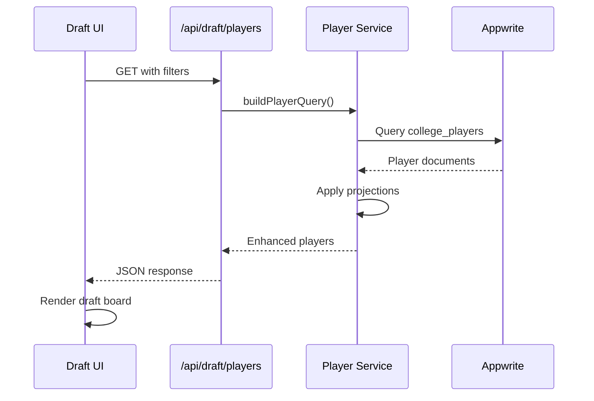

# API Query Flow

```mermaid
sequenceDiagram
    participant UI as Draft UI
    participant API as /api/draft/players
    participant SVC as Player Service
    participant DB as Appwrite
    
    UI->>API: GET with filters
    API->>SVC: buildPlayerQuery()
    SVC->>DB: Query college_players
    DB-->>SVC: Player documents
    SVC->>SVC: Apply projections
    SVC-->>API: Enhanced players
    API-->>UI: JSON response
    UI->>UI: Render draft board
```
