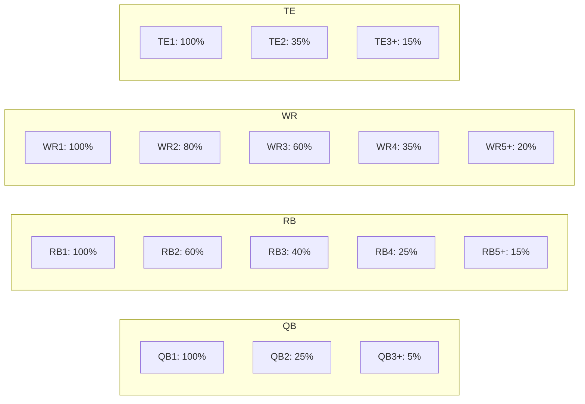

# Depth Chart Multipliers

```mermaid
flowchart LR
    subgraph QB
        QB1[QB1: 100%]
        QB2[QB2: 25%]
        QB3[QB3+: 5%]
    end
    
    subgraph RB
        RB1[RB1: 100%]
        RB2[RB2: 60%]
        RB3[RB3: 40%]
        RB4[RB4: 25%]
        RB5[RB5+: 15%]
    end
    
    subgraph WR
        WR1[WR1: 100%]
        WR2[WR2: 80%]
        WR3[WR3: 60%]
        WR4[WR4: 35%]
        WR5[WR5+: 20%]
    end
    
    subgraph TE
        TE1[TE1: 100%]
        TE2[TE2: 35%]
        TE3[TE3+: 15%]
    end
```
