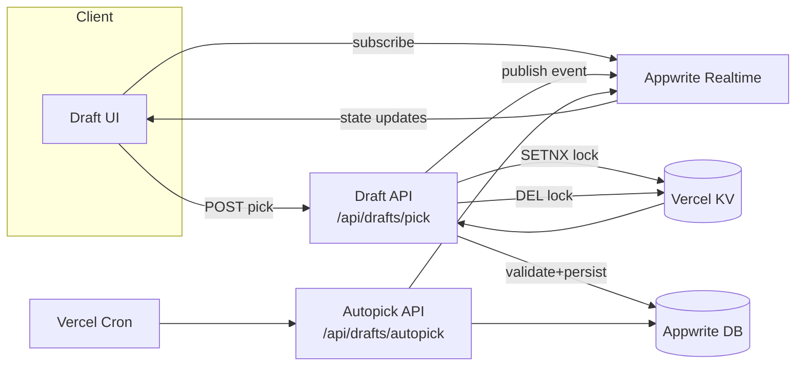

# Draft Flow (Real-time)

```mermaid
flowchart LR
    subgraph Client
        UI[Draft UI]
    end

    UI -->|subscribe| RT[Appwrite Realtime]
    UI -->|POST pick| DAPI[Draft API<br/>/api/drafts/pick]

    DAPI -->|SETNX lock| KV[(Vercel KV)]
    KV --> DAPI

    DAPI -->|validate+persist| DB[(Appwrite DB)]
    DAPI -->|publish event| RT
    DAPI -->|DEL lock| KV

    SCHED[Vercel Cron] --> AAPI[Autopick API<br/>/api/drafts/autopick]
    AAPI --> DB
    AAPI --> RT

    RT -->|state updates| UI
```
