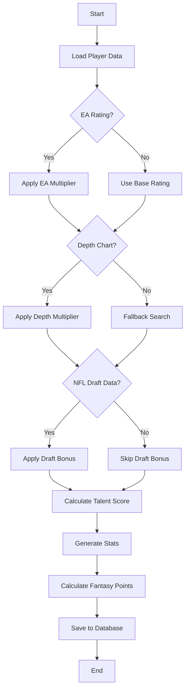

# Projection Algorithm Flow

```mermaid
flowchart TD
    START[Start] --> LOAD[Load Player Data]
    LOAD --> CHECK_EA{EA Rating?}
    CHECK_EA -->|Yes| EA_MULT[Apply EA Multiplier]
    CHECK_EA -->|No| EA_BASE[Use Base Rating]
    
    EA_MULT --> CHECK_DC{Depth Chart?}
    EA_BASE --> CHECK_DC
    
    CHECK_DC -->|Yes| DC_MULT[Apply Depth Multiplier]
    CHECK_DC -->|No| DC_FALL[Fallback Search]
    
    DC_MULT --> CHECK_NFL{NFL Draft Data?}
    DC_FALL --> CHECK_NFL
    
    CHECK_NFL -->|Yes| NFL_MULT[Apply Draft Bonus]
    CHECK_NFL -->|No| SKIP_NFL[Skip Draft Bonus]
    
    NFL_MULT --> TALENT[Calculate Talent Score]
    SKIP_NFL --> TALENT
    
    TALENT --> STATS[Generate Stats]
    STATS --> POINTS[Calculate Fantasy Points]
    POINTS --> SAVE[Save to Database]
    SAVE --> END[End]
```
