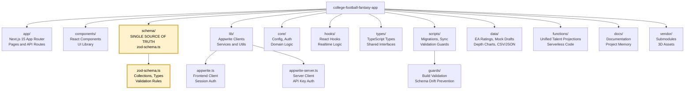

# Repository Structure

```mermaid
flowchart TD
    ROOT[college-football-fantasy-app]
    
    ROOT --> APP[app/<br/>Next.js 15 App Router<br/>Pages and API Routes]
    ROOT --> COMPONENTS[components/<br/>React Components<br/>UI Library]
    ROOT --> SCHEMA[schema/<br/>SINGLE SOURCE OF TRUTH<br/>zod-schema.ts]
    
    ROOT --> LIB[lib/<br/>Appwrite Clients<br/>Services and Utils]
    ROOT --> CORE[core/<br/>Config, Auth<br/>Domain Logic]
    ROOT --> HOOKS[hooks/<br/>React Hooks<br/>Realtime Logic]
    ROOT --> TYPES[types/<br/>TypeScript Types<br/>Shared Interfaces]
    
    ROOT --> SCRIPTS[scripts/<br/>Migrations, Sync<br/>Validation Guards]
    ROOT --> DATA[data/<br/>EA Ratings, Mock Drafts<br/>Depth Charts, CSV/JSON]
    ROOT --> FUNCTIONS[functions/<br/>Unified Talent Projections<br/>Serverless Code]
    
    ROOT --> DOCS[docs/<br/>Documentation<br/>Project Memory]
    ROOT --> VENDOR[vendor/<br/>Submodules<br/>3D Assets]
    
    SCHEMA --> SSOT[zod-schema.ts<br/>Collections, Types<br/>Validation Rules]
    LIB --> FRONTEND[appwrite.ts<br/>Frontend Client<br/>Session Auth]
    LIB --> BACKEND[appwrite-server.ts<br/>Server Client<br/>API Key Auth]
    SCRIPTS --> GUARDS[guards/<br/>Build Validation<br/>Schema Drift Prevention]
    
    style SCHEMA fill:#fff2cc,stroke:#d6b656,stroke-width:4px,color:#000000
    style SSOT fill:#fff2cc,stroke:#d6b656,stroke-width:4px,color:#000000
```
