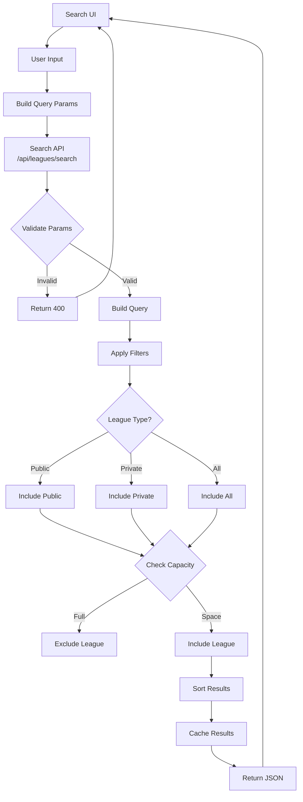

# Search & Filter Flow

```mermaid
flowchart TD
    UI[Search UI] --> INPUT[User Input]
    INPUT --> PARAMS[Build Query Params]
    
    PARAMS --> SAPI[Search API<br/>/api/leagues/search]
    SAPI --> VALIDATE{Validate Params}
    
    VALIDATE -->|Invalid| ERROR[Return 400]
    ERROR --> UI
    
    VALIDATE -->|Valid| BUILD[Build Query]
    BUILD --> FILTERS[Apply Filters]
    
    FILTERS --> TYPE{League Type?}
    TYPE -->|Public| PUBLIC[Include Public]
    TYPE -->|Private| PRIVATE[Include Private]
    TYPE -->|All| ALL[Include All]
    
    PUBLIC --> CAPACITY{Check Capacity}
    PRIVATE --> CAPACITY
    ALL --> CAPACITY
    
    CAPACITY -->|Full| EXCLUDE[Exclude League]
    CAPACITY -->|Space| INCLUDE[Include League]
    
    INCLUDE --> SORT[Sort Results]
    SORT --> CACHE[Cache Results]
    CACHE --> RETURN[Return JSON]
    RETURN --> UI
```
