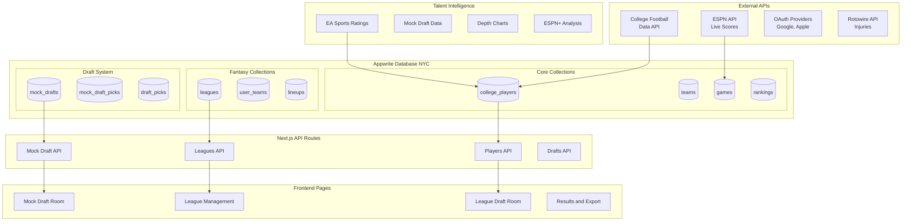

# System Architecture Overview

```mermaid
flowchart TB
    subgraph ExtAPIs[External APIs]
        CFBD[College Football<br/>Data API]
        ESPN[ESPN API<br/>Live Scores]
        OAUTH[OAuth Providers<br/>Google, Apple]
        ROTOWIRE[Rotowire API<br/>Injuries]
    end
    
    subgraph TalentIntel[Talent Intelligence]
        EA_DATA[EA Sports Ratings]
        MOCK_DATA[Mock Draft Data]
        DEPTH_DATA[Depth Charts]
        ESPN_PLUS[ESPN+ Analysis]
    end
    
    subgraph AppwriteDB[Appwrite Database NYC]
        subgraph CoreColls[Core Collections]
            PLAYERS[(college_players)]
            TEAMS[(teams)]
            GAMES[(games)]
            RANKINGS[(rankings)]
        end
        
        subgraph FantasyColls[Fantasy Collections]
            LEAGUES[(leagues)]
            USER_TEAMS[(user_teams)]
            LINEUPS[(lineups)]
        end
        
        subgraph DraftSys[Draft System]
            MOCK_DRAFTS[(mock_drafts)]
            MOCK_PICKS[(mock_draft_picks)]
            DRAFT_PICKS[(draft_picks)]
        end
    end
    
    subgraph APIRoutes[Next.js API Routes]
        API_PLAYERS[Players API]
        API_LEAGUES[Leagues API]
        API_MOCK[Mock Draft API]
        API_DRAFT[Drafts API]
    end
    
    subgraph FrontendPages[Frontend Pages]
        MOCK_DRAFT_UI[Mock Draft Room]
        DRAFT_UI[League Draft Room]
        LEAGUE_UI[League Management]
        RESULTS_UI[Results and Export]
    end
    
    CFBD --> PLAYERS
    ESPN --> GAMES
    EA_DATA --> PLAYERS
    
    PLAYERS --> API_PLAYERS
    LEAGUES --> API_LEAGUES
    MOCK_DRAFTS --> API_MOCK
    
    API_PLAYERS --> DRAFT_UI
    API_LEAGUES --> LEAGUE_UI
    API_MOCK --> MOCK_DRAFT_UI
```
