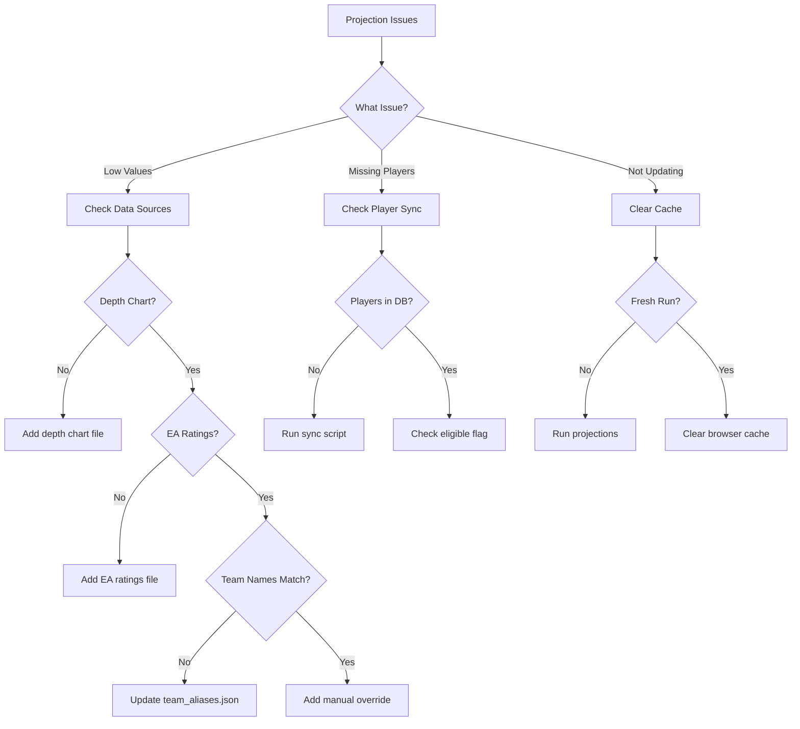

# Troubleshooting Guide

```mermaid
flowchart TD
    ISSUE[Projection Issues] --> TYPE{What Issue?}
    
    TYPE -->|Low Values| CHECK_DATA[Check Data Sources]
    TYPE -->|Missing Players| CHECK_SYNC[Check Player Sync]
    TYPE -->|Not Updating| CHECK_CACHE[Clear Cache]
    
    CHECK_DATA --> D1{Depth Chart?}
    D1 -->|No| ADD_DC[Add depth chart file]
    D1 -->|Yes| D2{EA Ratings?}
    
    D2 -->|No| ADD_EA[Add EA ratings file]
    D2 -->|Yes| D3{Team Names Match?}
    
    D3 -->|No| FIX_NAMES[Update team_aliases.json]
    D3 -->|Yes| CHECK_OVERRIDE[Add manual override]
    
    CHECK_SYNC --> S1{Players in DB?}
    S1 -->|No| RUN_SYNC[Run sync script]
    S1 -->|Yes| CHECK_ELIGIBLE[Check eligible flag]
    
    CHECK_CACHE --> C1{Fresh Run?}
    C1 -->|No| RUN_PROJ[Run projections]
    C1 -->|Yes| CLEAR_BROWSER[Clear browser cache]
```
