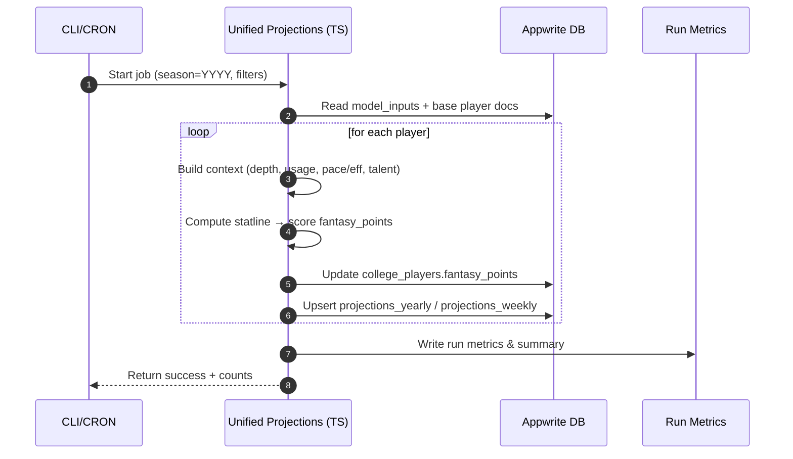

# CFB Fantasy — Projections Data Flow Diagrams

> Overview diagrams showing: **(1)** data fetching, **(2)** projection computation, **(3)** persistence, and **(4)** frontend rendering, plus a simple troubleshooting flow.

---

## 1) End‑to‑End Pipeline (Bird’s‑Eye View)

```mermaid
graph LR
  %% External Sources
  subgraph S[External Data Sources]
    CFBD[CFBD API\nPlayers, Games, Stats]
    ESPN[ESPN/News\nInjuries, Roles]
    VENDOR[Vendor Data\nEA Ratings, Mock Draft Capital]
  end

  %% Ingestion & Normalization
  subgraph I[Ingestion & Normalization]
    F1[Fetchers\n(HTTP/ETL jobs)]
    N1[Normalizers\n(parsers, joins)]
    MI[(model_inputs\nAppwrite collection)]
  end

  %% Projection Engine
  subgraph P[Projection Engine]
    C1[Build Player Context\n(depth, usage, pace/eff, talent)]
    C2[Compute Statline\n(usage × pace × eff)]
    C3[Apply Adjustments\n(depth weights, talent multipliers)]
    C4[Fantasy Scoring\n(points from statline)]
  end

  %% Persistence
  subgraph D[Persistence (Appwrite DB)]
    CP[(college_players\n.fantasy_points, .statline_simple)]
    PY[(projections_yearly)]
    PW[(projections_weekly)]
  end

  %% API + UI
  subgraph A[API & Frontend]
    API[/GET /api/draft/players\nQuery.equal('conference', ['SEC','Big Ten','Big 12','ACC'])\nQuery.equal('position', ['QB','RB','WR','TE','K'])\nQuery.orderDesc('fantasy_points')/]
    UI[Draft UI\n(Mock/Realtime)]
  end

  CFBD --> F1
  ESPN --> F1
  VENDOR --> F1
  F1 --> N1 --> MI

  MI --> C1 --> C2 --> C3 --> C4

  C4 --> CP
  C4 --> PY
  C4 --> PW

  CP -. primary source .-> API
  PY -. fallback/analytics .-> API
  API --> UI
```

---

## 2) Batch Projection Run — Sequence



---

## 3) Draft UI Fetch/Render — Sequence

```mermaid
sequenceDiagram
  autonumber
  participant U as User
  participant UI as Draft UI (Next.js)
  participant API as /api/draft/players
  participant SVC as ProjectionsService
  participant DB as Appwrite DB

  U->>UI: Open draft page
  UI->>API: GET ?limit=&orderBy=projection&filters
  API->>SVC: getPlayers()
  SVC->>DB: listDocuments('college_players', [
    Query.equal('conference', ['SEC','Big Ten','Big 12','ACC']),
    Query.equal('position', ['QB','RB','WR','TE','K']),
    Query.orderDesc('fantasy_points'),
    Query.limit(N), Query.offset(0)
  ])
  DB-->>SVC: Player docs (projection fields)
  SVC-->>API: Map → DTO (per‑game, statline, metadata)
  API-->>UI: JSON list of players
  UI->>UI: Render ranking, allow search/filters
  Note right of UI: Realtime draft room uses local state/WebSocket;\nprojections are read‑only inputs.
```

### 3.1) API Query Modes & Fallback

```mermaid
flowchart TD
  A[Incoming query params\nposition, conference, team/school, search, top200, orderBy, limit/offset] --> B{top200?}
  B -- Yes --> B1[Add Query.equal('position', ['QB','RB','WR','TE','K'])\nSet limit = min(requested, 200)]
  B -- No --> B2[If position provided and != 'ALL' → Query.equal('position', position)]

  A --> C{conference provided?}
  C -- Yes --> C1[Query.equal('conference', conference)]
  C -- No --> C2[Query.equal('conference', ['SEC','Big Ten','Big 12','ACC'])]

  A --> D{team/school provided?}
  D -- team --> D1[Query.equal('team', team)]
  D -- school --> D2[Query.equal('team', school)\nFallback pass uses Query.equal('school', school)]

  A --> E{search provided?}
  E -- Yes --> E1[Query.search('name', search)]
  E -- No --> E2[skip]

  A --> F{orderBy == 'name'?}
  F -- Yes --> F1[Query.orderAsc('name')]
  F -- No --> F2[Query.orderDesc('fantasy_points')]

  G[Primary query] --> H{Success?}
  H -- Yes --> R[Return documents]
  H -- No --> FB[Fallback query:\n- Query.limit + Query.offset only\n- Add basic equal filters if present\n- Always Query.orderDesc('fantasy_points')] --> R
```

Notes:
- top200 mode caps results to 200 and ensures fantasy positions filter is applied.
- Primary query prioritizes projection ordering (`fantasy_points` DESC). Name ordering is supported via `orderBy=name`.
- Fallback reduces filter complexity for non-indexed environments and maintains projection ordering.

---

## 4) Data Model (ER‑style overview)

```mermaid
erDiagram
  COLLEGE_PLAYERS {
    string $id PK // Appwrite doc id
    string name // max 100, fulltext indexed
    string position // QB|RB|WR|TE|K
    string team // school name
    string conference // SEC|Big Ten|Big 12|ACC
    int jerseyNumber optional
    string year optional
    string height optional
    int weight optional
    int depth_chart_order optional // 1..5
    float fantasy_points optional // primary projection field
    json statline_simple optional // serialized statline
    datetime $updatedAt
  }

  PROJECTIONS_YEARLY {
    string $id PK
    string player_id FK -> COLLEGE_PLAYERS.$id
    int season
    float fantasy_points_simple
    json statline_json
    int games_played_est
    datetime $updatedAt
  }

  PROJECTIONS_WEEKLY {
    string $id PK
    string player_id FK -> COLLEGE_PLAYERS.$id
    int season
    int week
    float fantasy_points_simple
    json statline_json
    datetime $updatedAt
  }

  MODEL_INPUTS {
    string $id PK
    string player_id FK -> COLLEGE_PLAYERS.$id optional
    int season
    json depth_chart_json optional
    json team_pace_json optional
    json pass_rush_rates_json optional
    json opponent_grades_by_pos_json optional
    json injury_reports_json optional
    json vegas_json optional
    json manual_overrides_json optional
    int ea_overall optional
    int ea_speed optional
    int draft_capital_score optional
    string notes optional
    datetime $updatedAt
  }

  COLLEGE_PLAYERS ||--o{ PROJECTIONS_YEARLY : has
  COLLEGE_PLAYERS ||--o{ PROJECTIONS_WEEKLY : has
  COLLEGE_PLAYERS ||--|| MODEL_INPUTS : uses
```

---

### Fields Legend (SSOT‑mapped)

| Collection | Key Fields | Notes |
|---|---|---|
| `college_players` | `$id`, `name`, `position`, `team`, `conference` | Primary projection source: `fantasy_points` DESC for UI ranking |
|  | `fantasy_points` | Calculated by pipeline; used by `/api/draft/players` ordering |
|  | `depth_chart_order` | 1..5, used for depth multipliers and team depth sorting |
|  | `statline_simple` | JSON string (serialized) for simple per‑season statline |
| `projections_yearly` | `$id`, `player_id`, `season`, `fantasy_points_simple`, `statline_json` | Analytics/longitudinal storage; not required for UI list |
| `projections_weekly` | `$id`, `player_id`, `season`, `week`, `fantasy_points_simple`, `statline_json` | Weekly breakdowns; optional for draft list |
| `model_inputs` | `$id`, `season`, `depth_chart_json`, `team_pace_json`, `manual_overrides_json` | Pipeline inputs and overrides staging |

---

## 5) Troubleshooting & Verification Flow

```mermaid
flowchart TD
  A[Draft UI shows empty/odd list?] --> B{Check env loaded?\nNEXT_PUBLIC_APPWRITE_*}
  B -- No --> B1[Fix .env.local / restart dev]
  B -- Yes --> C{Schema in sync?}
  C -- No --> C1[Run schema sync script]
  C -- Yes --> D{college_players.fantasy_points\nnon‑zero?}
  D -- No --> D1[Run projection job]\nD2[Confirm model_inputs present]
  D -- Yes --> E{API returns sorted list?}
  E -- No --> E1[curl /api/draft/players\nreview orderBy/filters]
  E -- Yes --> F[UI renders list\n→ OK]
```

---

### Notes

* **Primary source for the Draft UI** is `college_players.fantasy_points`. Yearly/weekly collections are useful for analytics and comparison but are not required to render the ranked draft list.
* The `model_inputs` collection acts as the staging area for all inputs (depth, usage priors, team pace/efficiency, talent signals). The engine uses it to build per‑player contexts before scoring.
* If projections appear stale, re‑run the batch job, then invalidate any local caches (dev server restart is usually enough).

---

### Indexes used by API queries (for performance)

- college_players.conference_rankings_idx
  - Attributes: `conference`, `position`, `fantasy_points`
  - Order: `ASC`, `ASC`, `DESC`
  - Query patterns: `conference = ? AND position = ? ORDER BY fantasy_points DESC`
  - Usage: high (primary for rankings)

- college_players.team_depth_chart_idx
  - Attributes: `team`, `position`, `depth_chart_order`
  - Order: `ASC`, `ASC`, `ASC`
  - Query patterns: `team = ? AND position = ? ORDER BY depth_chart_order ASC`
  - Usage: medium (depth-chart views and pipeline context)

- Name search uses Appwrite full‑text on `name` as configured (when `Query.search('name', search)` is present).


