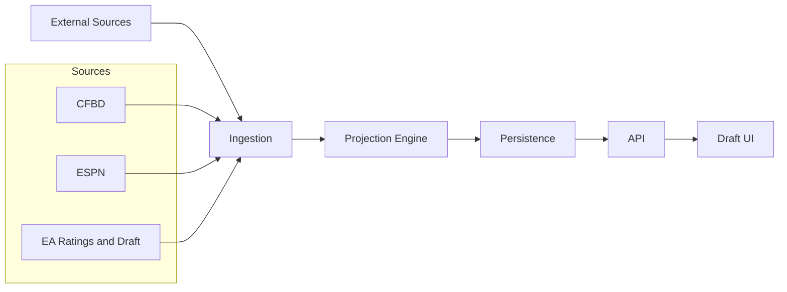
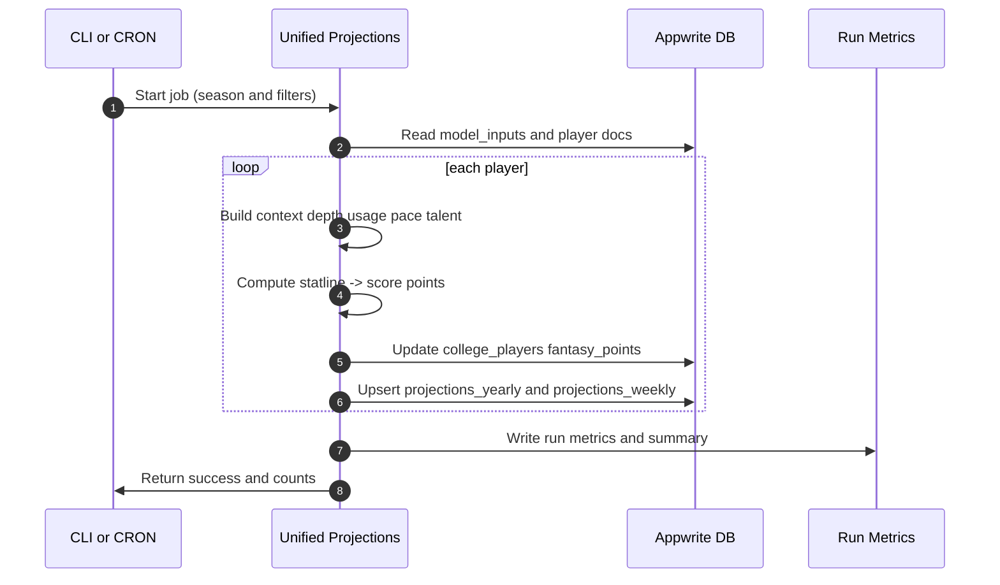
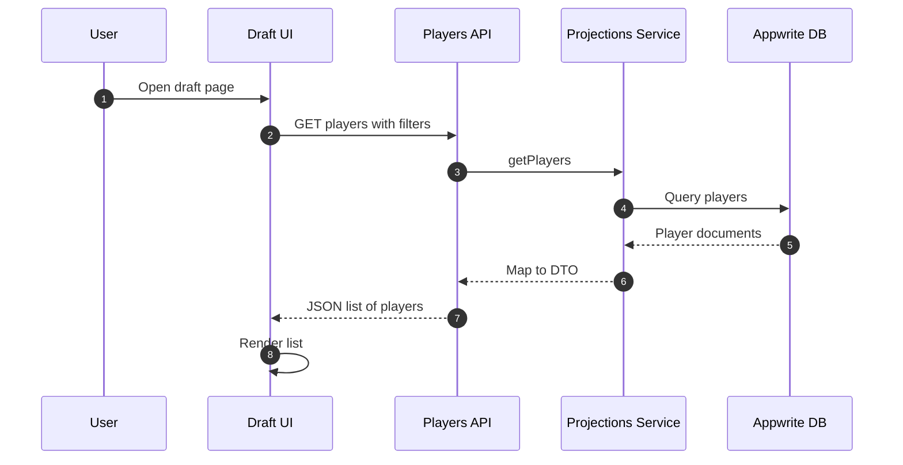
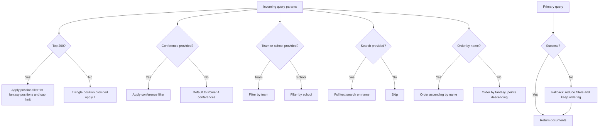
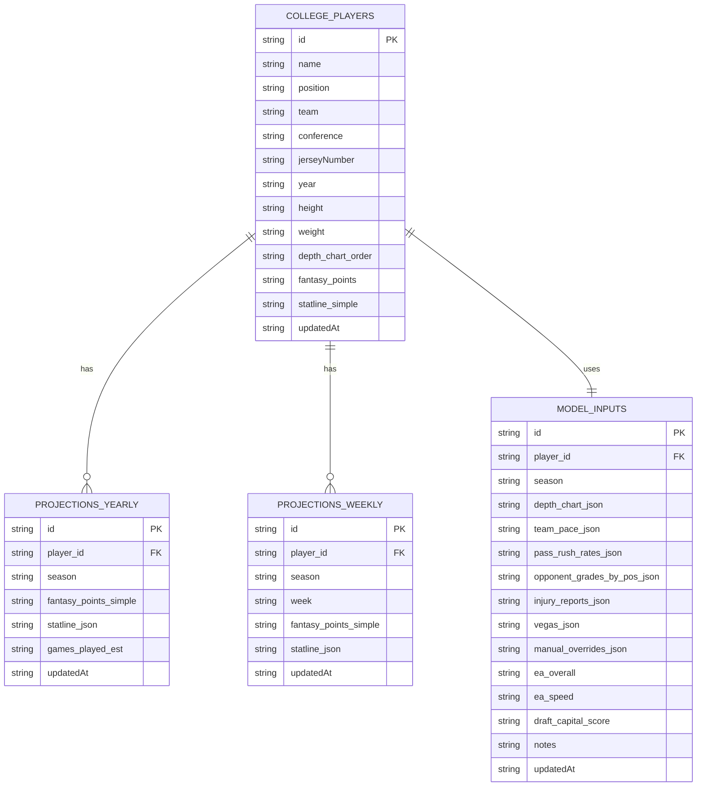
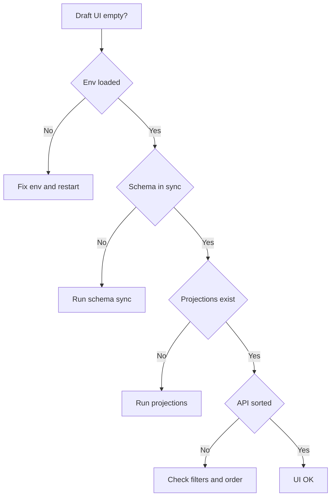

# CFB Fantasy — Projections Data Flow Diagrams

> Overview diagrams showing: **(1)** data fetching, **(2)** projection computation, **(3)** persistence, and **(4)** frontend rendering, plus a simple troubleshooting flow.

---

## 1) End‑to‑End Pipeline (Bird’s‑Eye View)

---

## 2) Batch Projection Run — Sequence

---

## 3) Draft UI Fetch/Render — Sequence

### 3.1) API Query Modes & Fallback

Notes:
- top200 mode caps results to 200 and ensures fantasy positions filter is applied.
- Primary query prioritizes projection ordering (`fantasy_points` DESC). Name ordering is supported via `orderBy=name`.
- Fallback reduces filter complexity for non-indexed environments and maintains projection ordering.

---

## 4) Data Model (ER‑style overview)

---

### Fields Legend (SSOT‑mapped)

| Collection | Key Fields | Notes |
|---|---|---|
| `college_players` | `$id`, `name`, `position`, `team`, `conference` | Primary projection source: `fantasy_points` DESC for UI ranking |
|  | `fantasy_points` | Calculated by pipeline; used by `/api/draft/players` ordering |
|  | `depth_chart_order` | 1..5, used for depth multipliers and team depth sorting |
|  | `statline_simple` | JSON string (serialized) for simple per‑season statline |
| `projections_yearly` | `$id`, `player_id`, `season`, `fantasy_points_simple`, `statline_json` | Analytics/longitudinal storage; not required for UI list |
| `projections_weekly` | `$id`, `player_id`, `season`, `week`, `fantasy_points_simple`, `statline_json` | Weekly breakdowns; optional for draft list |
| `model_inputs` | `$id`, `season`, `depth_chart_json`, `team_pace_json`, `manual_overrides_json` | Pipeline inputs and overrides staging |

---

## 5) Troubleshooting & Verification Flow

---

### Notes

* **Primary source for the Draft UI** is `college_players.fantasy_points`. Yearly/weekly collections are useful for analytics and comparison but are not required to render the ranked draft list.
* The `model_inputs` collection acts as the staging area for all inputs (depth, usage priors, team pace/efficiency, talent signals). The engine uses it to build per‑player contexts before scoring.
* If projections appear stale, re‑run the batch job, then invalidate any local caches (dev server restart is usually enough).

---

### Indexes used by API queries (for performance)

- college_players.conference_rankings_idx
  - Attributes: `conference`, `position`, `fantasy_points`
  - Order: `ASC`, `ASC`, `DESC`
  - Query patterns: `conference = ? AND position = ? ORDER BY fantasy_points DESC`
  - Usage: high (primary for rankings)

- college_players.team_depth_chart_idx
  - Attributes: `team`, `position`, `depth_chart_order`
  - Order: `ASC`, `ASC`, `ASC`
  - Query patterns: `team = ? AND position = ? ORDER BY depth_chart_order ASC`
  - Usage: medium (depth-chart views and pipeline context)

- Name search uses Appwrite full‑text on `name` as configured (when `Query.search('name', search)` is present).

