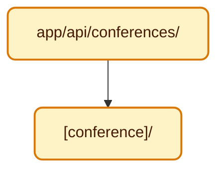

# Project Map — app/api/conferences

```mermaid
flowchart TB
  classDef folder fill:#fef3c7,stroke:#d97706,stroke-width:2,color:#451a03,rx:8,ry:8
  classDef file fill:#f0fdf4,stroke:#65a30d,stroke-width:1.5,color:#422006,rx:4,ry:4
  app_api_conferences["app/api/conferences/" ]
  class app_api_conferences folder
  app_api_conferences__conference_["[conference]/"]
  class app_api_conferences__conference_ folder
  app_api_conferences --> app_api_conferences__conference_
```
