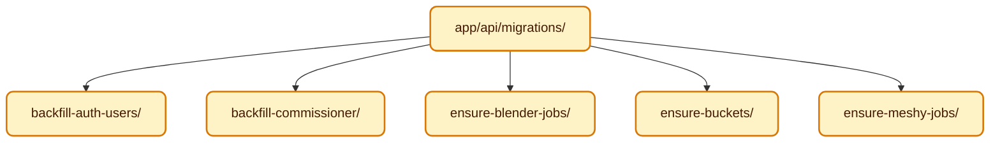

# Project Map — app/api/migrations

```mermaid
flowchart TB
  classDef folder fill:#fef3c7,stroke:#d97706,stroke-width:2,color:#451a03,rx:8,ry:8
  classDef file fill:#f0fdf4,stroke:#65a30d,stroke-width:1.5,color:#422006,rx:4,ry:4
  app_api_migrations["app/api/migrations/" ]
  class app_api_migrations folder
  app_api_migrations_backfill_auth_users["backfill-auth-users/"]
  class app_api_migrations_backfill_auth_users folder
  app_api_migrations --> app_api_migrations_backfill_auth_users
  app_api_migrations_backfill_commissioner["backfill-commissioner/"]
  class app_api_migrations_backfill_commissioner folder
  app_api_migrations --> app_api_migrations_backfill_commissioner
  app_api_migrations_ensure_blender_jobs["ensure-blender-jobs/"]
  class app_api_migrations_ensure_blender_jobs folder
  app_api_migrations --> app_api_migrations_ensure_blender_jobs
  app_api_migrations_ensure_buckets["ensure-buckets/"]
  class app_api_migrations_ensure_buckets folder
  app_api_migrations --> app_api_migrations_ensure_buckets
  app_api_migrations_ensure_meshy_jobs["ensure-meshy-jobs/"]
  class app_api_migrations_ensure_meshy_jobs folder
  app_api_migrations --> app_api_migrations_ensure_meshy_jobs
```
