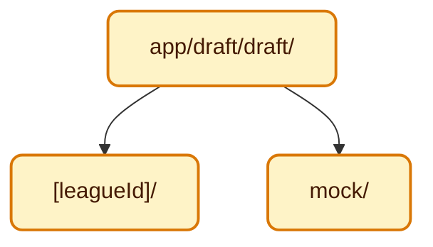

# Project Map — app/draft/draft

```mermaid
flowchart TB
  classDef folder fill:#fef3c7,stroke:#d97706,stroke-width:2,color:#451a03,rx:8,ry:8
  classDef file fill:#f0fdf4,stroke:#65a30d,stroke-width:1.5,color:#422006,rx:4,ry:4
  app_draft_draft["app/draft/draft/" ]
  class app_draft_draft folder
  app_draft_draft__leagueId_["[leagueId]/"]
  class app_draft_draft__leagueId_ folder
  app_draft_draft --> app_draft_draft__leagueId_
  app_draft_draft_mock["mock/"]
  class app_draft_draft_mock folder
  app_draft_draft --> app_draft_draft_mock
```
