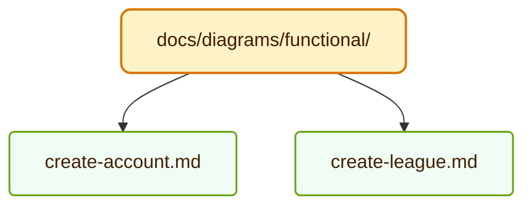

# Project Map — docs/diagrams/functional

```mermaid
flowchart TB
  classDef folder fill:#fef3c7,stroke:#d97706,stroke-width:2,color:#451a03,rx:8,ry:8
  classDef file fill:#f0fdf4,stroke:#65a30d,stroke-width:1.5,color:#422006,rx:4,ry:4
  docs_diagrams_functional["docs/diagrams/functional/" ]
  class docs_diagrams_functional folder
  docs_diagrams_functional_create_account_md["create-account.md"]
  class docs_diagrams_functional_create_account_md file
  docs_diagrams_functional --> docs_diagrams_functional_create_account_md
  docs_diagrams_functional_create_league_md["create-league.md"]
  class docs_diagrams_functional_create_league_md file
  docs_diagrams_functional --> docs_diagrams_functional_create_league_md
```
