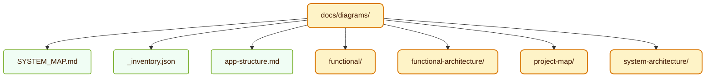

# Project Map — docs/diagrams

```mermaid
flowchart TB
  classDef folder fill:#fef3c7,stroke:#d97706,stroke-width:2,color:#451a03,rx:8,ry:8
  classDef file fill:#f0fdf4,stroke:#65a30d,stroke-width:1.5,color:#422006,rx:4,ry:4
  docs_diagrams["docs/diagrams/" ]
  class docs_diagrams folder
  docs_diagrams_SYSTEM_MAP_md["SYSTEM_MAP.md"]
  class docs_diagrams_SYSTEM_MAP_md file
  docs_diagrams --> docs_diagrams_SYSTEM_MAP_md
  docs_diagrams__inventory_json["_inventory.json"]
  class docs_diagrams__inventory_json file
  docs_diagrams --> docs_diagrams__inventory_json
  docs_diagrams_app_structure_md["app-structure.md"]
  class docs_diagrams_app_structure_md file
  docs_diagrams --> docs_diagrams_app_structure_md
  docs_diagrams_functional["functional/"]
  class docs_diagrams_functional folder
  docs_diagrams --> docs_diagrams_functional
  click docs_diagrams_functional "/admin/project-map/docs/diagrams/functional" "Open functional"
  docs_diagrams_functional_architecture["functional-architecture/"]
  class docs_diagrams_functional_architecture folder
  docs_diagrams --> docs_diagrams_functional_architecture
  click docs_diagrams_functional_architecture "/admin/project-map/docs/diagrams/functional-architecture" "Open functional-architecture"
  docs_diagrams_project_map["project-map/"]
  class docs_diagrams_project_map folder
  docs_diagrams --> docs_diagrams_project_map
  click docs_diagrams_project_map "/admin/project-map/docs/diagrams/project-map" "Open project-map"
  docs_diagrams_system_architecture["system-architecture/"]
  class docs_diagrams_system_architecture folder
  docs_diagrams --> docs_diagrams_system_architecture
  click docs_diagrams_system_architecture "/admin/project-map/docs/diagrams/system-architecture" "Open system-architecture"
```
