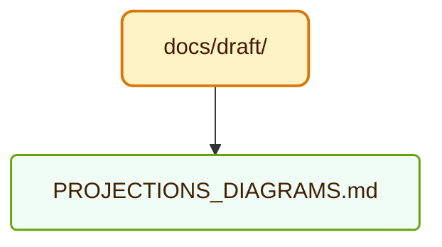

# Project Map — docs/draft

```mermaid
flowchart TB
  classDef folder fill:#fef3c7,stroke:#d97706,stroke-width:2,color:#451a03,rx:8,ry:8
  classDef file fill:#f0fdf4,stroke:#65a30d,stroke-width:1.5,color:#422006,rx:4,ry:4
  docs_draft["docs/draft/" ]
  class docs_draft folder
  docs_draft_PROJECTIONS_DIAGRAMS_md["PROJECTIONS_DIAGRAMS.md"]
  class docs_draft_PROJECTIONS_DIAGRAMS_md file
  docs_draft --> docs_draft_PROJECTIONS_DIAGRAMS_md
```
